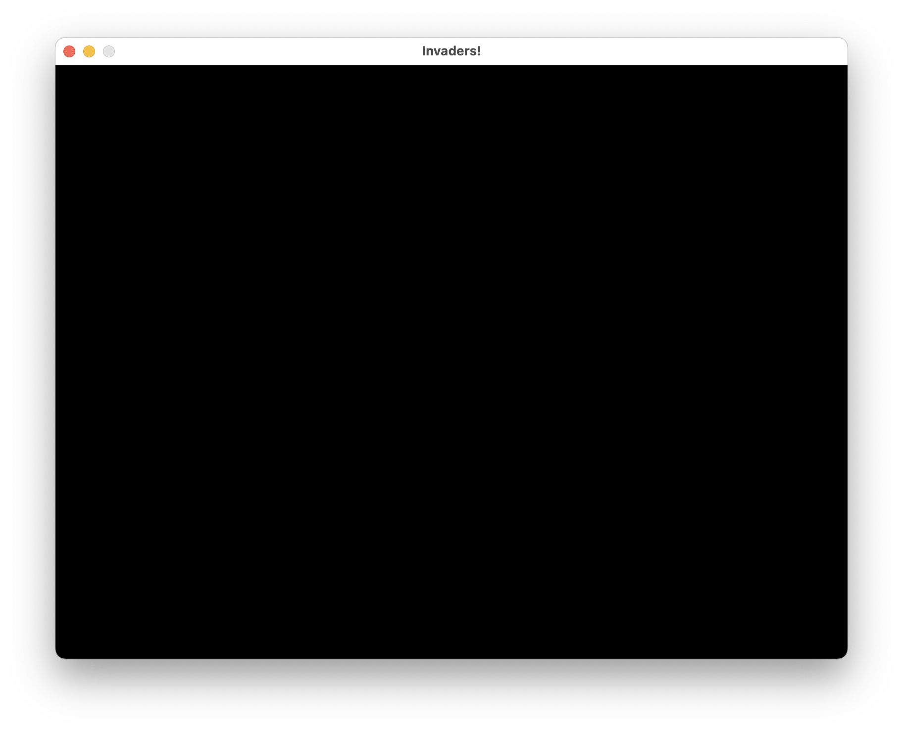
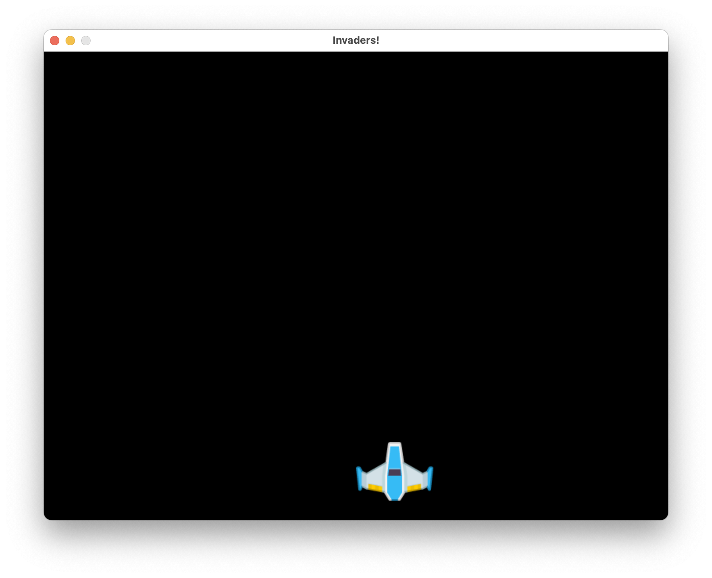
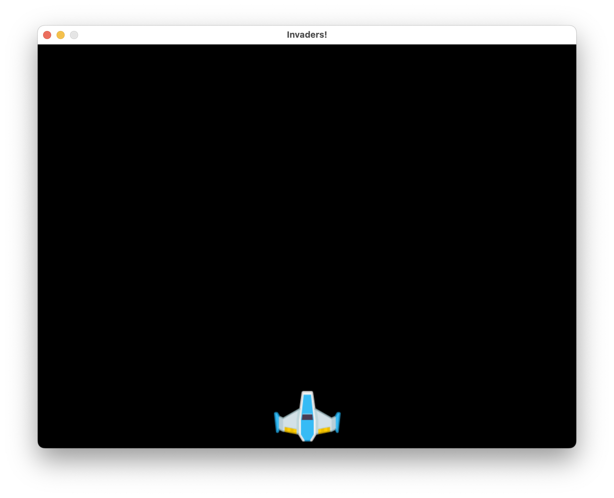
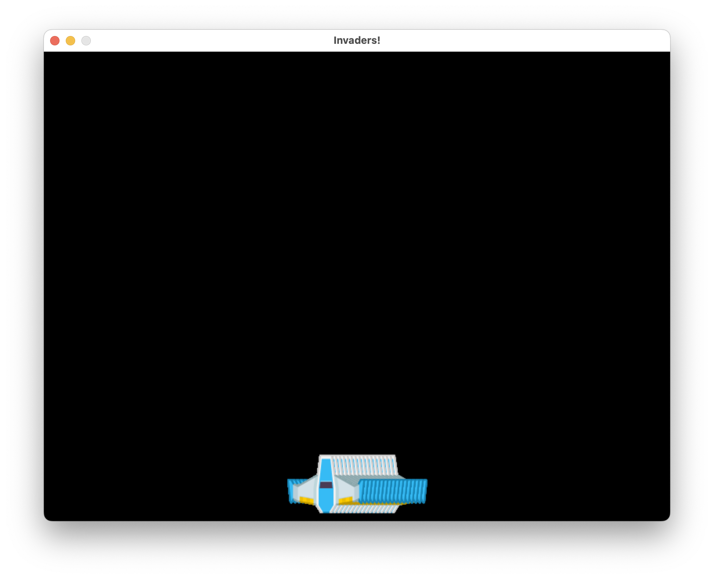
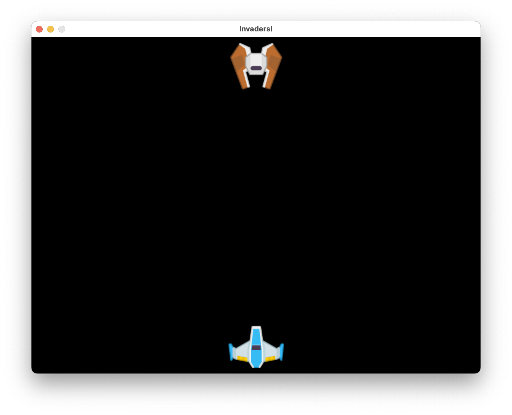
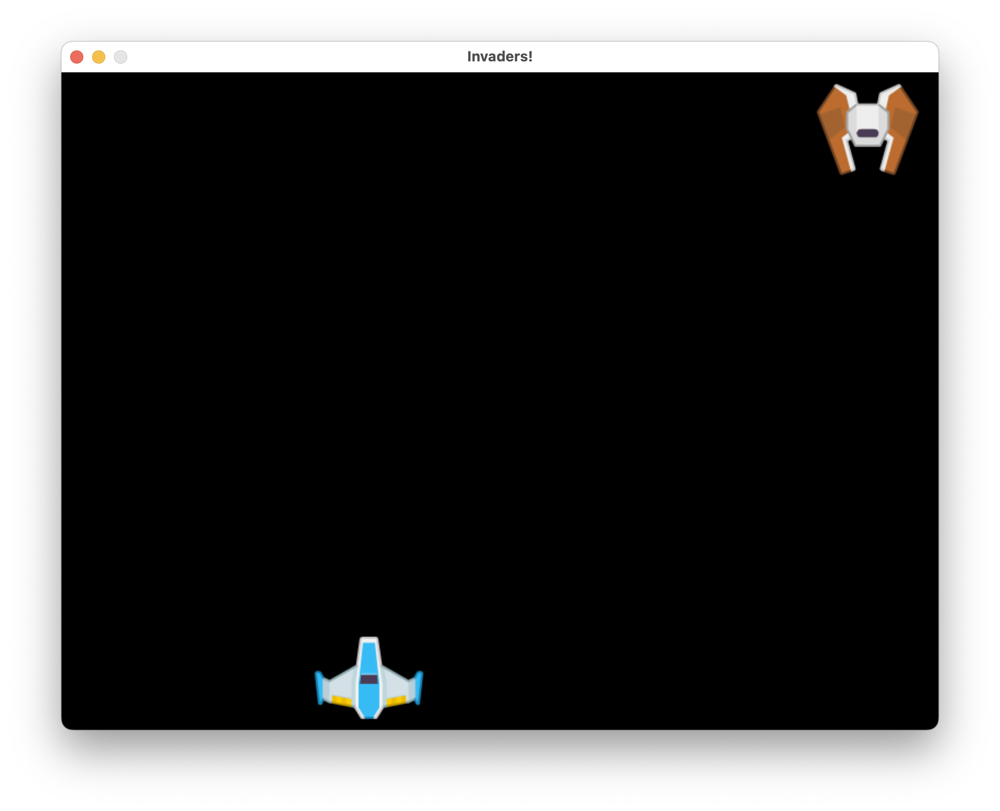
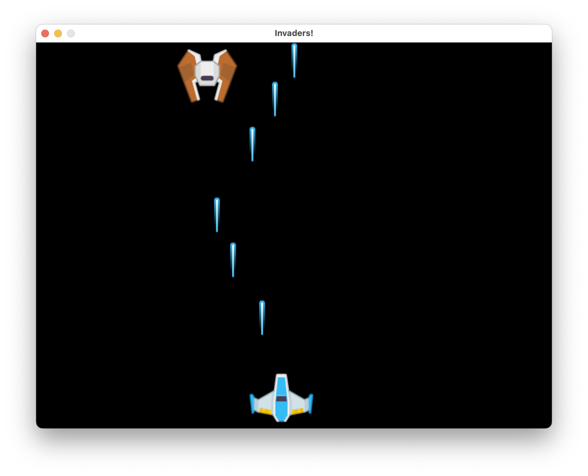

<link rel="stylesheet" href="../common/sheet.css">

<table class="key_info">
<tr><td class="difficulty">Difficulty: <b>🌶🌶</b><i>🌶🌶🌶</i></td>
<td>Language: Python</td>
<td>Requires: Laptop with Python, coderdojo [games]</td></tr>
</table>


Waves of aliens are attacking the Earth! We need to defend our planet by shooting them down with our laser cannon.
In this you will learn how to use the pygame library to make a game, along with classes and lists.

This sheet recommends using Thonny in Python 3 mode.

### Assets

Get the assets with `kenney-assets install space-shooter-redux`

## Starting up pygame

Pygame needs a couple of things to get started:

```python
import pygame

WIDTH=800
HEIGHT=600
FPS=30

pygame.init()
screen = pygame.display.set_mode((WIDTH, HEIGHT))
pygame.display.set_caption("Invaders!")
clock = pygame.time.Clock()

running = True
while running:
    for event in pygame.event.get():
        if event.type == pygame.QUIT:
            running = False
    clock.tick(FPS)
```

We've set a display size, you can adjust to something bigger if you like.
There's a caption, which is the text that appears in the window title bar.

We also have a clock so the game can run at a consistent speed.

The `running` variable is used to control the main loop, and the `for` loop is used to process events. Events are things like mouse clicks, key presses, and window close events.
At this point, this only handles closing the window.



## Drawing a player

We need a player to shoot the aliens, so let's draw one.

We'll show added code with a `+` sign, with lines around it to show where. Do not type the `+` sign.

```diff
clock = pygame.time.Clock()
+ asset_path = "assets/space-shooter-redux/PNG/"
+ player_img = pygame.image.load(asset_path + "playerShip1_blue.png")
```

We are loading the image here, and storing it in the `player_img` variable. The variable `asset_path` will help us load assets.

Then in the main loop we need to draw it:

```diff
while running:
    for event in pygame.event.get():
        if event.type == pygame.QUIT:
            running = False
+   screen.blit(player_img, (WIDTH/2, HEIGHT-100))
+   pygame.display.update()
    clock.tick(FPS)
```

You should now see a player ship near the bottom of the screen.



## Centering the player

You might have noticed that the player ship is not centred on the screen.

```diff
  player_img = pygame.image.load(asset_path + "playerShip1_blue.png")
+ player_rect = player_img.get_rect()
+ player_rect.centerx = WIDTH/2
+ player_rect.bottom = HEIGHT-10
````

The `-` sign in the code means that we've removed a line and swapped it for something else. Do not type the `-` sign. Make this change in the main loop:

```diff
-   screen.blit(player_img, (WIDTH/2, HEIGHT-100))
+   screen.blit(player_img, player_rect))
    pygame.display.update()
```

We've fixed this by using the `get_rect()` method to get the size of the image, and then centring it. We can also set the bottom of the image to be 10 pixels above the bottom of the screen.

We've also changed the `blit` call to use the `player_rect` variable instead of the coordinates.



## Moving the player

This isn't much fun yet. We want things to move.
We'll use the left and right arrow keys to move the player.

```diff
    for event in pygame.event.get():
        if event.type == pygame.QUIT:
            running = False
+   keys = pygame.key.get_pressed()
+   if keys[pygame.K_LEFT]:
+       player_rect.centerx -= 5
+   elif keys[pygame.K_RIGHT]:
+       player_rect.centerx += 5
    screen.blit(player_img, player_rect)
    pygame.display.update()
    clock.tick(FPS)
```

This code checks for key presses, and moves the player left or right by 5 pixels. Let's run this!



Hmm - this doesn't quite look right! It's gliding around leaving trails.

We need to clear the screen before we draw the player. We can do this by filling the screen with a colour:

```diff
+   screen.fill((0,0,0))
    screen.blit(player_img, player_rect)
    pygame.display.update()
```

## Checkpoint

Your code at this stage should look like:

```python
import pygame

WIDTH=800
HEIGHT=600
FPS=30

pygame.init()
screen = pygame.display.set_mode((WIDTH, HEIGHT))
pygame.display.set_caption("Invaders!")
clock = pygame.time.Clock()
asset_path = "assets/space-shooter-redux/PNG/"
player_img = pygame.image.load(asset_path + "playerShip1_blue.png")
player_rect = player_img.get_rect()
player_rect.centerx = WIDTH/2
player_rect.bottom = HEIGHT-10


running = True
while running:
    for event in pygame.event.get():
        if event.type == pygame.QUIT:
            running = False
    keys = pygame.key.get_pressed()
    if keys[pygame.K_LEFT]:
        player_rect.centerx -= 5
    elif keys[pygame.K_RIGHT]:
        player_rect.centerx += 5
    screen.fill((0,0,0))
    screen.blit(player_img, player_rect)
    pygame.display.update()
    clock.tick(FPS)
```

## Adding an alien

We need some aliens to shoot at. Let's add one.

```diff
+ alien_img = pygame.image.load(asset_path + "Enemies/enemyRed1.png")
+ alien_rect = alien_img.get_rect()
+ alien_rect.centerx = WIDTH/2
+ alien_rect.top = 10
```

We can then draw it in the main loop:

```diff
    screen.fill((0,0,0))
    screen.blit(player_img, player_rect)
+   screen.blit(alien_img, alien_rect)
    pygame.display.update()
```



This is ok, but it's not very exciting.
We are going to make an alien sprite class, and use this to move the alien.

```diff
alien_img = pygame.image.load(asset_path + "Enemies/enemyRed1.png")
- alien_rect = alien_img.get_rect()
- alien_rect.centerx = WIDTH/2
- alien_rect.top = 10
+ class Alien(pygame.sprite.Sprite):
+     def __init__(self):
+         pygame.sprite.Sprite.__init__(self)
+         self.image = alien_img
+         self.rect = self.image.get_rect()
+         self.rect.centerx = WIDTH/2
+         self.rect.top = 10
+         self.speedx = 5
+
+   def update(self):
+       self.rect.centerx += self.speedx
+       if self.rect.right > WIDTH:
+         self.speedx = -5
+       if self.rect.left < 0:
+         self.speedx = 5
+
+  def draw(self):
+       screen.blit(self.image, self.rect)
+ alien = Alien()
```

We've moved the code for creating the alien into this class. The class lets us group together the code for the alien, and makes it easier to add more aliens later. It's built from a Pygame sprite, so it can borrow code from the Pygame sprite class.

A `method` is like a function, but can use variables from the class.

The class has an `__init__` method, which is a recipe to make an alien. The `Alien` also has an `update` method to move it. This uses a `speedx` (as in speed in the x direction) variable to move, and when the alien reaches the edge of the screen, it reverses direction. 
We've also added a `draw` method to draw the alien.


Let's use this in the main loop:

```diff
    screen.fill((0,0,0))
    screen.blit(player_img, player_rect)
-   screen.blit(alien_img, alien_rect)
+   alien.update()
+   alien.draw()
    pygame.display.update()
```



## Alien movement Checkpoint

Your code at this stage should look like:

```python
import pygame

WIDTH=800
HEIGHT=600
FPS=30

pygame.init()
screen = pygame.display.set_mode((WIDTH, HEIGHT))
pygame.display.set_caption("Invaders!")
clock = pygame.time.Clock()
asset_path = "assets/space-shooter-redux/PNG/"
player_img = pygame.image.load(asset_path + "playerShip1_blue.png")
player_rect = player_img.get_rect()
player_rect.centerx = WIDTH/2
player_rect.bottom = HEIGHT-10
alien_img = pygame.image.load(asset_path + "Enemies/enemyRed1.png")

class Alien(pygame.sprite.Sprite):
    def __init__(self):
        pygame.sprite.Sprite.__init__(self)
        self.image = alien_img
        self.rect = self.image.get_rect()
        self.rect.centerx = WIDTH/2
        self.rect.top = 10
        self.speedx = 5

    def update(self):
        self.rect.centerx += self.speedx
        if self.rect.right > WIDTH:
          self.speedx = -5
        if self.rect.left < 0:
          self.speedx = 5

    def draw(self):
        screen.blit(self.image, self.rect)

alien = Alien()

running = True
while running:
    for event in pygame.event.get():
        if event.type == pygame.QUIT:
            running = False
    keys = pygame.key.get_pressed()
    if keys[pygame.K_LEFT]:
        player_rect.centerx -= 5
    elif keys[pygame.K_RIGHT]:
        player_rect.centerx += 5
    screen.fill((0,0,0))
    screen.blit(player_img, player_rect)
    alien.update()
    alien.draw()  
    pygame.display.update()
    clock.tick(FPS)
```

## Adding a bullet

The player should shoot lasers at the alien. Let's add a bullet class for these.

```diff
+ bullet_img = pygame.image.load(asset_path + "Lasers/laserBlue01.png")
+ class Bullet(pygame.sprite.Sprite):
+     def __init__(self):
+         pygame.sprite.Sprite.__init__(self)
+         self.image = bullet_img
+         self.rect = self.image.get_rect()
+         self.rect.centerx = player_rect.centerx
+         self.rect.bottom = player_rect.top
+         self.speedy = -10
+
+     def update(self):
+         self.rect.y += self.speedy
+         if self.rect.bottom < 0:
+             self.kill()

alien = Alien()
```

This has a `speedy` variable to move the bullet up the screen. It also has a `kill` method to remove the bullet from the game.

Pygame can manage a group of sprites for us, so we can add a group for the bullets:

```diff

alien = Alien()

+ all_sprites = pygame.sprite.Group()
+ all_sprites.add(alien)
+ bullets = pygame.sprite.Group()
```

We can then add a bullet to the game when the player presses the space bar:

```diff
    for event in pygame.event.get():
        if event.type == pygame.QUIT:
            running = False
+       elif event.type == pygame.KEYDOWN:
+           if event.key == pygame.K_SPACE:
+               bullet = Bullet()
+               all_sprites.add(bullet)
+               bullets.add(bullet)
    if keys[pygame.K_LEFT]:
        player_rect.centerx -= 5
    elif keys[pygame.K_RIGHT]:
        player_rect.centerx += 5
```

We can then update and draw the alien and bullet sprites in the main loop:

```diff
+   all_sprites.update()
    screen.fill((0,0,0))
    screen.blit(player_img, player_rect)
-    alien.update()
-    alien.draw()
+   all_sprites.draw(screen)
    pygame.display.update()
```

The all_sprites draw method will automatically blit sprite images to the screen with their rects.



These bullets are nice, but they are sailing right through the enemy. We need to add some collision detection.

## Bullets Checkpoint

```python
import pygame

WIDTH=800
HEIGHT=600
FPS=30

pygame.init()
screen = pygame.display.set_mode((WIDTH, HEIGHT))
pygame.display.set_caption("Invaders!")
clock = pygame.time.Clock()
asset_path = "assets/space-shooter-redux/PNG/"
player_img = pygame.image.load(asset_path + "playerShip1_blue.png")
player_rect = player_img.get_rect()
player_rect.centerx = WIDTH/2
player_rect.bottom = HEIGHT-10

class Alien(pygame.sprite.Sprite):
    def __init__(self):
        pygame.sprite.Sprite.__init__(self)
        self.image = pygame.image.load(asset_path + "Enemies/enemyRed1.png")
        self.rect = self.image.get_rect()
        self.rect.centerx = WIDTH/2
        self.rect.top = 10
        self.speedx = 5

    def update(self):
        self.rect.centerx += self.speedx
        if self.rect.right > WIDTH:
          self.speedx = -5
        if self.rect.left < 0:
          self.speedx = 5

    def draw(self):
        screen.blit(self.image, self.rect)

class Bullet(pygame.sprite.Sprite):
    def __init__(self):
        pygame.sprite.Sprite.__init__(self)
        self.image = pygame.image.load(asset_path + "Lasers/laserBlue01.png")
        self.rect = self.image.get_rect()
        self.rect.centerx = player_rect.centerx
        self.rect.bottom = player_rect.top
        self.speedy = -10

    def update(self):
        self.rect.y += self.speedy
        if self.rect.bottom < 0:
            self.kill()

    def draw(self):
        screen.blit(self.image, self.rect)

alien = Alien()
all_sprites = pygame.sprite.Group()
all_sprites.add(alien)
bullets = pygame.sprite.Group()

running = True
while running:
    for event in pygame.event.get():
        if event.type == pygame.QUIT:
            running = False
        elif event.type == pygame.KEYDOWN:
            if event.key == pygame.K_SPACE:
                bullet = Bullet()
                all_sprites.add(bullet)
                bullets.add(bullet)            
    keys = pygame.key.get_pressed()
    if keys[pygame.K_LEFT]:
        player_rect.centerx -= 5
    elif keys[pygame.K_RIGHT]:
        player_rect.centerx += 5
    all_sprites.update()
    screen.fill((0,0,0))
    screen.blit(player_img, player_rect)
    all_sprites.draw(screen)
    pygame.display.update()
    clock.tick(FPS)
```

## Collisions!

We want to stop those aliens somehow. Let's help the bullets make contact.

```diff
    all_sprites.update()
+   hits = pygame.sprite.spritecollide(alien, bullets, True)
+   if hits:
+       alien.kill()
    screen.fill((0,0,0))
    screen.blit(player_img, player_rect)
```

The good news is that the sprite groups, along with the rectangles make this easy! We can use the `spritecollide` method to check if any of the bullets have collided with the alien. If they have, we can remove the alien and the bullet.

We can run this, and you should be able to fire and shoot down the alien.
However, there's not much fanfare, the alien simply disappears. Let's add some explosions.

### Explosions

We can add an explosion class to the game. This will be a sprite that will be added to the game when the alien is killed.

First - let's load some explosion images:

```diff
alien_img = pygame.image.load(asset_path + "Enemies/enemyRed1.png")
bullet_img = pygame.image.load(asset_path + "Lasers/laserBlue01.png")
+explosion_anim = [
+    pygame.image.load(asset_path + "Effects/star1.png.png"),
+    pygame.image.load(asset_path + "Effects/star2.png.png"),
+    pygame.image.load(asset_path + "Effects/star3.png.png")
+]
```

Then we can add an alien explosion class (after the Bullet class):

```diff
+class AlienExplosion(pygame.sprite.Sprite):
+    def __init__(self, center):
+        pygame.sprite.Sprite.__init__(self)
+        self.image = explosion_anim[0]
+        self.rect = self.image.get_rect()
+        self.rect.center = center
+        self.frame = 0
+        self.last_update = pygame.time.get_ticks()
+        self.frame_rate = 10
+
+    def update(self):
+        now = pygame.time.get_ticks()
+        if now - self.last_update > self.frame_rate:
+            self.last_update = now
+            self.frame += 1
+            if self.frame == len(explosion_anim):
+                self.kill()
+            else:
+                center = self.rect.center
+                self.image = explosion_anim[self.frame]
+                self.rect = self.image.get_rect()
+                self.rect.center = center
```

This has an update to cycle through the explosion images at the explosion frame rate. It will then kill itself when it has finished.

We can then add the explosion to the collision handling area in the main loop:

```diff
    all_sprites.update()
    hits = pygame.sprite.spritecollide(alien, bullets, True)
    if hits:
        alien.kill()
+       explosion = AlienExplosion(alien.rect.center)
+       all_sprites.add(explosion)
    screen.fill((0,0,0))
```

## Alien shoots back!

The player can shoot the alien, but the alien can't shoot the player. Let's add that. We first need to put the player in a Sprite:

```diff
player_img = pygame.image.load(asset_path + "playerShip1_blue.png")
-player_rect = player_img.get_rect()
-player_rect.centerx = WIDTH/2
-player_rect.bottom = HEIGHT-10
```

And then we can add the player class, above the Alien class:
```diff
+class Player(pygame.sprite.Sprite):
+    def __init__(self):
+        pygame.sprite.Sprite.__init__(self)
+        self.image = player_img
+        self.rect = self.image.get_rect()
+        self.rect.centerx = WIDTH/2
+        self.rect.bottom = HEIGHT-10
+
+    def draw(self):
+       screen.blit(self.image, self.rect)
```

The bullet class can be modified to use the player rect:

```diff
class Bullet(pygame.sprite.Sprite):
-    def __init__(self):
+    def __init__(self, player_rect):
        pygame.sprite.Sprite.__init__(self)
```

We can then add the player to the sprite group:

```diff
alien = Alien()
+player = Player()
all_sprites = pygame.sprite.Group()
all_sprites.add(alien)
+all_sprites.add(player)
```

We need to modify the key handlers to use the player class rect:
    
```diff
        elif event.type == pygame.KEYDOWN:
            if event.key == pygame.K_SPACE:
-               bullet = Bullet()
+               bullet = Bullet(player.rect)
                all_sprites.add(bullet)
                bullets.add(bullet)
    keys = pygame.key.get_pressed()                
    if keys[pygame.K_LEFT]:
-       player_rect.centerx -= 5
+       player.rect.centerx -= 5
    elif keys[pygame.K_RIGHT]:
-       player_rect.centerx += 5
+       player.rect.centerx += 5
```

We can remove the player drawing code from the main loop, as it will be drawn with all sprites:

```diff
    screen.fill((0,0,0))
-   screen.blit(player_img, player_rect)
    all_sprites.draw(screen)
```

Run this code, and at this point it should be the same as before. We can now add the alien shooting code.

### Alien shooting

Let's load an alien bullet image:

```diff
bullet_img = pygame.image.load(asset_path + "Lasers/laserBlue01.png")
+alien_bullet_img = pygame.image.load(asset_path + "Lasers/laserRed04.png")
```

We can add a new class for the alien bullet. It will lot very similar to the bullet class.

```diff
+class AlienBullet(pygame.sprite.Sprite):
+    def __init__(self, alien_rect):
+        pygame.sprite.Sprite.__init__(self)
+        self.image = alien_bullet_img
+        self.rect = self.image.get_rect()
+        self.rect.centerx = alien_rect.centerx
+        self.rect.bottom = alien_rect.bottom
+        self.speedy = 10
+
+   def update(self):
+       self.rect.y += self.speedy
+       if self.rect.bottom > HEIGHT:
+           self.kill()
+   
```