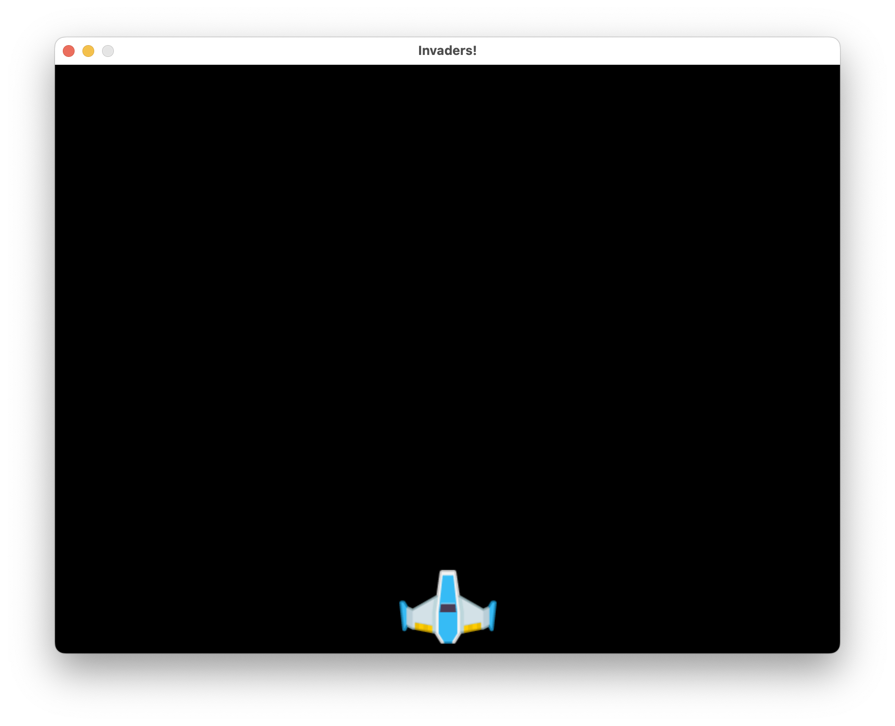
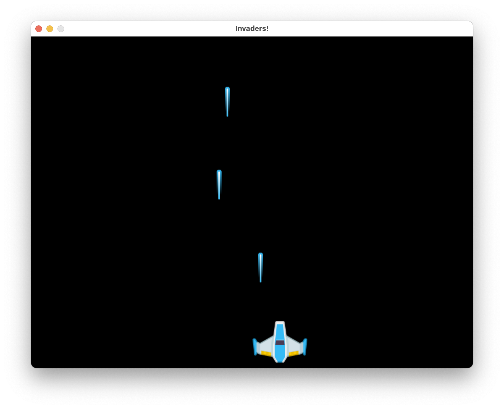
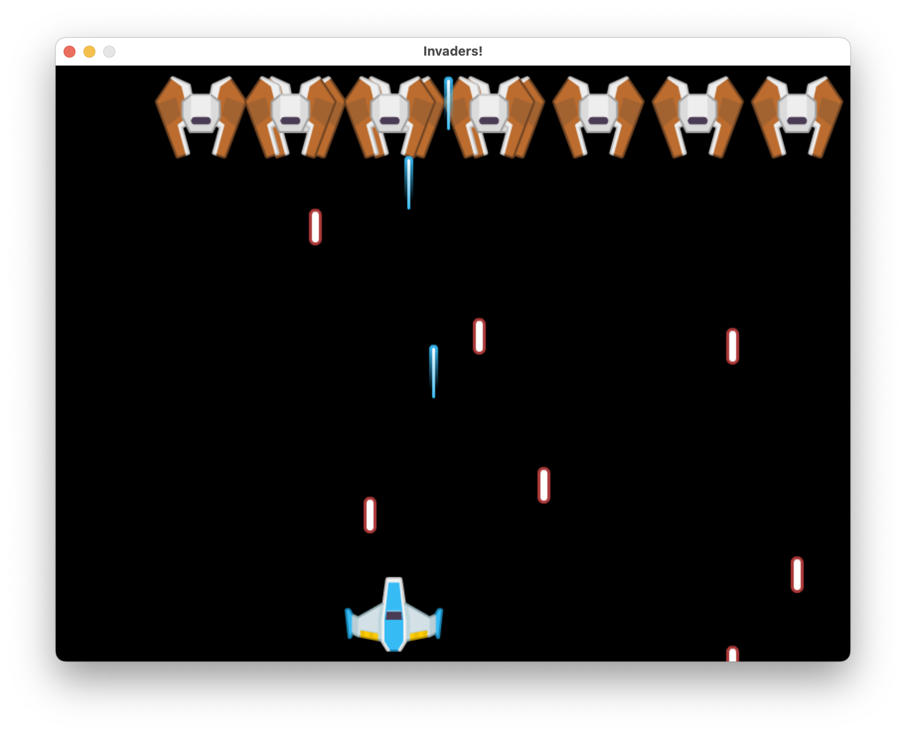
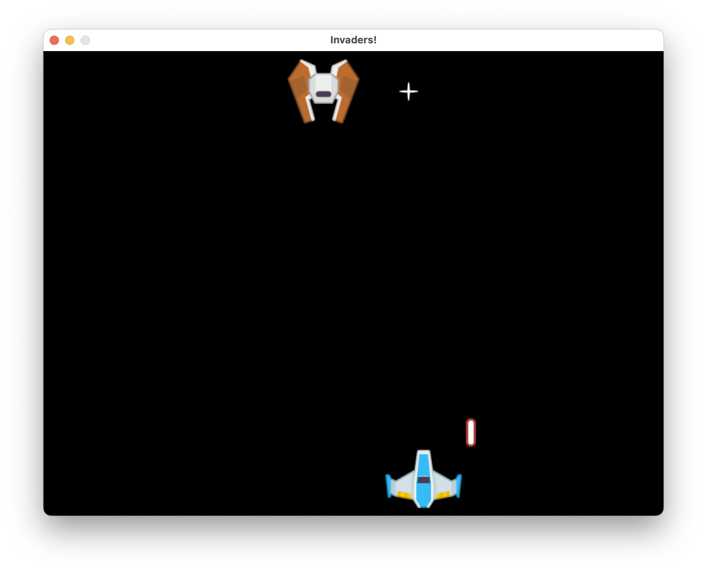
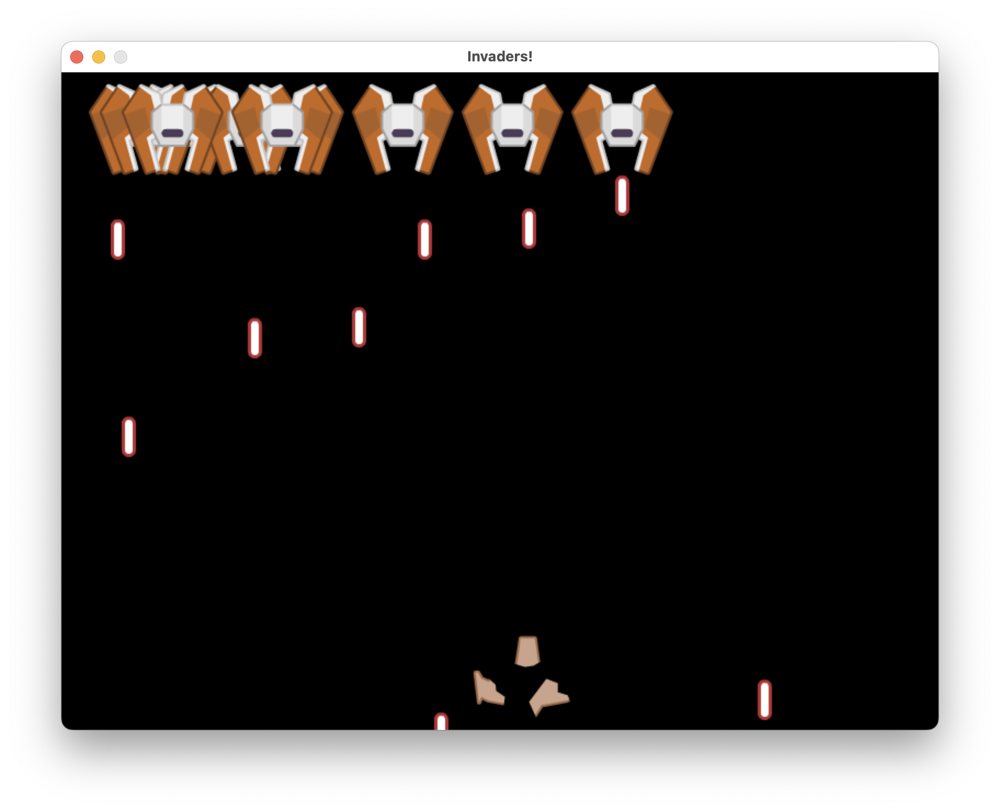

# Invaders!

<div class="key-info">
<div>Difficulty: <span class="chillies">🌶🌶🌶</span><span class="remainingchillies">🌶🌶</span></div><div>Language: Python
</div><div>Requires: Laptop with Python, Thonny and coderdojo [games]</div>
</div>

![[step_3.png|300]]![[step_4.png|300]]
![[qr-code.png|100]]

Waves of aliens are attacking the Earth! We need to defend our planet by shooting them down with our laser cannon.
In this you will learn how to use the `pygame` library to make a game, along with classes, python imports and `pygame` sprite groups. This game will be made using multiple files, so you can see how to organise your code.

Please take care with names and case. Python is case sensitive, so `Player` is different to `player`. If you get an error, check your spelling and capitalisation.

This sheet recommends using Thonny in Python 3 mode and the `coder-dojo-common-python[games]` package.

Throughout this sheet we will use diff blocks to show you what changes we're making to code or files to add. For instance:

```diff
+ this is a new line to add into your code
- this is a line to remove from your code
  and this is a line not to touch.
```

Sheet link: <https://github.com/coder-dojo-ham/coder-dojo-worksheets/blob/main/python/pygame_invaders/invaders.pdf>

### Assets

Create a folder for this game named "`invaders`". If using mu, put this under the "`mu_code`" folder.
Download the assets from <https://kenney.nl/assets/space-shooter-redux>, and unzip into a folder called "`assets`" in the same folder as your code.

```diff
invaders
+ |- assets/spaceshooter-redux
```

## Step 1 - The player



### Configuration

A few configuration variables allow us to setup the size and speed of our game, along with where the assets are.

```diff
invaders
  |- assets/spaceshooter-redux
+ |- config.py
```

Make a file "`config.py`" and add the following:

```python
ASSET_PATH = "assets/space-shooter-redux/PNG/"
WIDTH = 800
HEIGHT = 600
FPS = 30
```

Asset path will indicate what folder on your computer the game will load its assets from.

### The player

We'll create a Player sprite class, loading an image from the assets path.

```diff
invaders
  |- assets/spaceshooter-redux
  |- config.py
+ |- player.py
```

Create a new file called "`player.py`" and add the following:

```python
import pygame
from config import *

player_img = pygame.image.load(ASSET_PATH + "playerShip1_blue.png")

class Player(pygame.sprite.Sprite):
    def __init__(self):
        pygame.sprite.Sprite.__init__(self)
        self.image = player_img
        self.rect = self.image.get_rect()
        self.rect.centerx = WIDTH/2
        self.rect.bottom = HEIGHT-10
```

We load the player ship image with `pygame.image.load`. You could have a look in the assets and change this for another ship if you like.

The Pygame sprite needs a rectangle to describe its position and size. We've based this on the image size, and centred it on the screen.

The rectangle in `self.rect` is where the x and y coordinates or the image are calculated. In pygame, we can set the centrex and y, or we can use handy things like `bottom` to set the y coordinate of the bottom of the player sprite. We use `image.get_rect` to get the right sized rectangle for the image.

You can run this to check for errors, but it won't show anything yet.

### The game

The file `main.py` will load the other parts of the game in, and runs the main loop.

```diff
invaders
  |- assets/spaceshooter-redux
  |- config.py
+ |- main.py
  |- player.py
```

Let's import the player and the config we've just made.

Create a new file called "`main.py`" and add the following:

```python
import pygame

from config import *
from player import Player
```

We need to set up the screen with a title and a clock to control the game speed. If you want you can change that title!

```python
pygame.init()

screen = pygame.display.set_mode((WIDTH, HEIGHT))
pygame.display.set_caption("Invaders!")
clock = pygame.time.Clock()
```

Sprite groups let us do things to a bunch of sprites at once, like drawing them all. Let's create a group of sprites, and add the player to it:

```python
all_sprites = pygame.sprite.Group()

player = Player()
all_sprites.add(player)
```

Next is the main loop. It handles events, like a quit event, and draws the sprites. It also ticks the clock to keep the game running at the right speed.

```python
running = True
while running:
    for event in pygame.event.get():
        if event.type == pygame.QUIT:
            running = False
    screen.fill((0,0,0))
    all_sprites.draw(screen)
    pygame.display.update()
    clock.tick(FPS)
```

The double brackets on the screen.fill line are deliberate. The screen.fill parameter is a colour, represented as a tuple of (red, green, blue) values. Using 0's for all of them gives us black. You can change this to other colours for a different background - it mixes (red, green, blue) where each value is between 0 and 255.

At this point you can run the game and see the player on screen.

The variable `running` is used to keep the game running until we quit. `while` the variable `running` is true, the game loop will go. The `for` loop goes through all the events that have happened since the last frame, and checks if we've quit. If we have, we set `running` to `False` and the game will stop.

`main.py` is the file you should run to start the game.
Test and run this code to see the player on screen.

## Step 2 - The player moves



We are going to add player controls and weapon firing for the player.

### Weapons hot!

Let's make a file called `weapons.py` and add a class for the player's weapon. This will look quite similar to the player file.

```diff
invaders
  |- assets/spaceshooter-redux
  |- config.py
  |- main.py
  |- player.py
+ |- weapons.py
```

Create a new file called "`weapons.py`" and add the following:

```python
import pygame
from config import *

bullet_img = pygame.image.load(ASSET_PATH + "Lasers/laserBlue01.png")


class Bullet(pygame.sprite.Sprite):
    def __init__(self, player_rect):
        pygame.sprite.Sprite.__init__(self)
        self.image = bullet_img
        self.rect = self.image.get_rect()
        self.rect.centerx = player_rect.centerx
        self.rect.bottom = player_rect.top
        self.speedy = -10

    def update(self):
        self.rect.y += self.speedy
        if self.rect.bottom < 0:
            self.kill()
```

This sprite is created with a player rect, so it knows where to start. It sets its owm bottom coordinate to the top (front) of the player sprite. It moves up the screen at a constant speed `speedy`, and is removed when it goes off the top of the screen with the call to `self.kill()`.

Sprites can have an `update` method, which is called every frame. This is where we can move the sprite.

### Taking control!

At the top of `main.py`, after importing Player, add the bullet import line:

```diff
 from player import Player
+from weapons import Bullet
 pygame.init()
```

We'll also add a bullets group to specifically track these. Next to the `all_sprites` creation add:

```diff
 all_sprites = pygame.sprite.Group()
+bullets = pygame.sprite.Group()
```

Let's add movement controls to the main loop:

```diff
 while running:
     for event in pygame.event.get():
         if event.type == pygame.QUIT:
             running = False
+        elif event.type == pygame.KEYDOWN:
+            if event.key == pygame.K_SPACE:
+                bullet = Bullet(player.rect)
+                all_sprites.add(bullet)
+                bullets.add(bullet)
+    keys = pygame.key.get_pressed()
+    if keys[pygame.K_LEFT]:
+        player.rect.centerx -= 5
+    elif keys[pygame.K_RIGHT]:
+        player.rect.centerx += 5
     all_sprites.update()
     screen.fill((0,0,0))
     all_sprites.draw(screen)
     pygame.display.update()
     clock.tick(FPS)
```

This handles firing as a key down event, but movement is based on held keys. We use `pygame.key.get_pressed` to get a list of all the keys. Those that are currently pressed will be `True`. We can then check if the left or right keys are pressed, and move the player accordingly.

Run this and you should be able to move the player left and right, and fire bullets with the space bar.

## Step 3 - The aliens



We'll add some aliens to the game, and make them move across the screen.

### Aliens

Let's make a file called "`alien.py`" and add a class for the alien sprite. This will look quite similar to the player file.

```diff
invaders
  |- assets/spaceshooter-redux
+ |- alien.py
  |- config.py
  |- main.py
  |- player.py
  |- weapons.py
```

Create a new file called "`alien.py`" and add the following:

```python
import random

import pygame

from config import *
from weapons import AlienBullet


alien_img = pygame.image.load(ASSET_PATH + "Enemies/enemyRed1.png")

class Alien(pygame.sprite.Sprite):
    fire_rate = 1300
    def __init__(self, all_sprites, alien_bullets):
        pygame.sprite.Sprite.__init__(self)
        self.image = alien_img
        self.rect = self.image.get_rect()
        self.rect.centerx = WIDTH/2
        self.rect.top = 10
        self.speedx = 5

        self.all_sprites = all_sprites
        self.alien_bullets = alien_bullets
        # firing
        self.next_shot = pygame.time.get_ticks() + random.randint(Alien.fire_rate, Alien.fire_rate * 2)
```

The alien needs to know about the all sprites, and will be firing bullets later. There's a firing rate, with a random time for when the alien takes a shot.

```python
    def update(self):
        self.rect.centerx += self.speedx
        if self.rect.right > WIDTH:
            self.speedx = -5
        if self.rect.left < 0:
            self.speedx = 5
        # fire if it's time
        now = pygame.time.get_ticks()
        if now > self.next_shot:
            self.next_shot = now + random.randint(Alien.fire_rate, Alien.fire_rate * 2)
            bullet = AlienBullet(self.rect)
            self.all_sprites.add(bullet)
            self.alien_bullets.add(bullet)
```

The alien moves back and forth across the screen. When it's time to fire, it creates a bullet and adds it to the all sprites and alien bullets groups.

### Invasion!

We don't just have one alien, we have a bunch. Lets create a bunch of aliens in alien.py:

```python
aliens = pygame.sprite.Group()

def spawn_aliens(all_sprites, alien_bullets):
    for i in range(10):
        alien = Alien(all_sprites, alien_bullets)
        alien.rect.x = 100 + i * 100
        all_sprites.add(alien)
        aliens.add(alien)
```

This creates 10 aliens, and adds them to the all sprites and aliens groups.

### Alien weapons

The aliens are already trying to fire bullets, but it's importing a class that doesn't exist yet `AlienBullet`. Let's add this to the file "`weapons.py`":

```python
alien_bullet_img = pygame.image.load(ASSET_PATH + "Lasers/laserRed04.png")


class AlienBullet(pygame.sprite.Sprite):
    def __init__(self, alien_rect):
        pygame.sprite.Sprite.__init__(self)
        self.image = alien_bullet_img
        self.rect = self.image.get_rect()
        self.rect.centerx = alien_rect.centerx
        self.rect.top = alien_rect.bottom
        self.speedy = 10
    
    def update(self):
        self.rect.y += self.speedy
        if self.rect.top > HEIGHT:
            self.kill()
```

This looks very similar to the player bullet, but it's moving down the screen instead of up.

### Putting the aliens in the game

We need to add these into main.  At the top of "`main.py`", after importing Alien, add the alien bullet import line:

```diff
 from weapons import Bullet
+from alien import spawn_aliens
 pygame.init()
```

We'll also add a alien bullets group to specifically track these. Next to the `bullets` creation add:

```diff
 bullets = pygame.sprite.Group()
+alien_bullets = pygame.sprite.Group()
```

Now we can spawn the aliens in after the player:
    
```diff
player = Player()
all_sprites.add(player) 
+spawn_aliens(all_sprites, alien_bullets)
```

Because we already draw and update all sprites in the main loop, it doesn't need to change. You can now run this, and should see aliens moving around and firing back at you!

## Step 4 - Collisions



The weapons are all a little ineffective. You are shooting at each other, but nothing is happening. Let's add some collisions.

### It's boomy time!

We want to be able to hit an alien, and a satisfying explosion to show they are gone. Let's add some explosion special effects to our game.

```diff
invaders
  |- assets/spaceshooter-redux
  |- alien.py
  |- config.py
+ |- explosion.py
  |- main.py
  |- player.py
  |- weapons.py
```

Create a file called "`explosion.py`" and add the following:

```python
import pygame

class Explosion(pygame.sprite.Sprite):
    def __init__(self, center, frames):
        pygame.sprite.Sprite.__init__(self)
        self.image = frames[0]
        self.rect = self.image.get_rect()
        self.rect.center = center
        self.animation_frames = frames
        self.frame = 0
        self.last_update = pygame.time.get_ticks()
        self.frame_rate = 50

    def update(self):
        now = pygame.time.get_ticks()
        if now - self.last_update > self.frame_rate:
            self.last_update = now
            self.frame += 1
            if self.frame == len(self.animation_frames):
                self.kill()
            else:
                center = self.rect.center
                self.image = self.animation_frames[self.frame]
                self.rect = self.image.get_rect()
                self.rect.center = center
```

This explosion class takes a center point, and a list of frames to animate. It will animate the frames at a rate of 50ms per frame.
This class uses the explosion animation images, and updates the image every 50 milliseconds. When the animation is complete, it uses kill.self to remove itself from the game.

### Another one bites the dust!

At the top of "`alien.py`" add the following to make use of our new explosion class:

```diff
 from config import *
 from weapons import AlienBullet
+from explosion import Explosion
```

We can now make alien explosions. Let's load 3 images to animate the explosion. Add the following to the bottom of "`alien.py`":

```python

explosion_anim = [
    pygame.image.load(ASSET_PATH + "Effects/star1.png"),
    pygame.image.load(ASSET_PATH + "Effects/star2.png"),
    pygame.image.load(ASSET_PATH + "Effects/star3.png")
]
```

We add a function in "`alien.py`" to check for collisions between bullets and aliens. Add the following to the bottom of "`alien.py`":

```python
def collide_aliens(bullets, all_sprites):
    for alien in aliens:
        hits = pygame.sprite.spritecollide(alien, bullets, True)
        if hits:
            alien.kill()
            explosion = Explosion(alien.rect.center, explosion_anim)
            all_sprites.add(explosion)
```

This will check for collisions between the aliens and the bullets. If there is a collision, the alien is killed, and an explosion is created.

### Putting it in the game

We need to import our collision function, and add it to the main loop. At the top of "`main.py`" add collide_aliens to the import from alien:

```diff
 from alien import spawn_aliens, collide_aliens
```

Then in the main loop, add the check after the `all_sprites.update()` line:

```diff
 all_sprites.update()
+collide_aliens(bullets, all_sprites)
```

Now you should be able to shoot the aliens, and see them explode!

## Step 5 - Get wrecked!



You've been able to watch alien bullets sail right through the ship. We need to add collisions for the player too.

### Impact detected!

The player explosion is very similar to the alien explosion. First we need to import the explosion class in "`player.py`":

```diff
 from config import *
+from explosion import Explosion
```

Now we load some frames for the explosion. Add the following to the bottom of `player.py`:

```python
player_explosion_anim = [
    pygame.image.load(ASSET_PATH + "Damage/playerShip1_damage3.png"),
    pygame.image.load(ASSET_PATH + "Damage/playerShip1_damage2.png"),
    pygame.image.load(ASSET_PATH + "Damage/playerShip1_damage1.png")
]
```

The next thing is to check the player against incoming alien bullets. Add this at the bottom of `player.py`:

```python
def collide_player_alien_bullets(all_sprites, player, alien_bullets):
    if not player.alive():
        return
    hits = pygame.sprite.spritecollide(player, alien_bullets, True)
    if hits:
        player.kill()
        explosion = Explosion(player.rect.center, player_explosion_anim)
        all_sprites.add(explosion)
```

This function checks if the player is alive, and if there are any collisions between the player and the alien bullets. If there are, the player is killed, and an explosion is created.

### Putting it in the game

Finally we need to add the collision check to the main loop. At the top of `main.py` add the following import:

```diff
 from config import *
-from player import Player
+from player import Player, collide_player_alien_bullets
from weapons import Bullet
```

Then in the main loop, add the following line after the `collide_aliens(bullets, all_sprites)` line:

```diff
    collide_aliens(bullets, all_sprites)
+   collide_player_alien_bullets(all_sprites, player, alien_bullets)
```

Run this and you and the aliens can now shoot at each other until someone dies!

## Step 6 - Game over

We can change the title for a simple game over. 
First, in `main.py` we need to stop letting the player shoot if they are dead:

```diff
    if event.type == pygame.KEYDOWN:
-       if event.key == pygame.K_SPACE:
+       if event.key == pygame.K_SPACE and player.alive():
                bullet = Bullet(player.rect)
                all_sprites.add(bullet)
                bullets.add(bullet)
```

We can then change the game caption if the player is dead:

```diff
    collide_player_alien_bullets(all_sprites, player, alien_bullets)
+   if not player.alive():
+       pygame.display.set_caption("Game Over!")
    screen.fill((0,0,0))
```

Now when you die, the window title will change to "Game Over!"

## Files summary

You should have these files in your project now:

```diff
invaders
  |- assets/spaceshooter-redux - images
  |- alien.py - Alien movement
  |- config.py - Game settings
  |- explosion.py - Explosion animation
  |- main.py - Main game loop - run this
  |- player.py - Player movement
  |- weapons.py - Bullet movement
```

## Ideas to extend this

This game doesn't really have a win condition, and not much happens when you lose.

- You can add a Game Over screen, so that when the player dies, it shows this other screen - either using pygame text, or a big image.
- Could you get PyGame to draw stars?
- The game could offer to restart when the player dies.
- If all the aliens die, you could also add a win screen.
- Aliens moving around are a bit easy to dodge forever, maybe they could move down a bit when they hit the sides of the screen?
- You could spawn in more aliens when all the aliens die, so they come in waves.
- You could add a score, and show it on the screen.
- The player dies on one hit, but you could make it so that the player has a few lives, and dies after a few hits.
- You could use techniques from the make it rain tutorial to add a moving starfield background.
- You could have a background image, and add the player and aliens on top of it.
- Add powerups, like a shield, or a faster firing weapon.
- Add a boss alien, that takes a lot of hits to kill.
