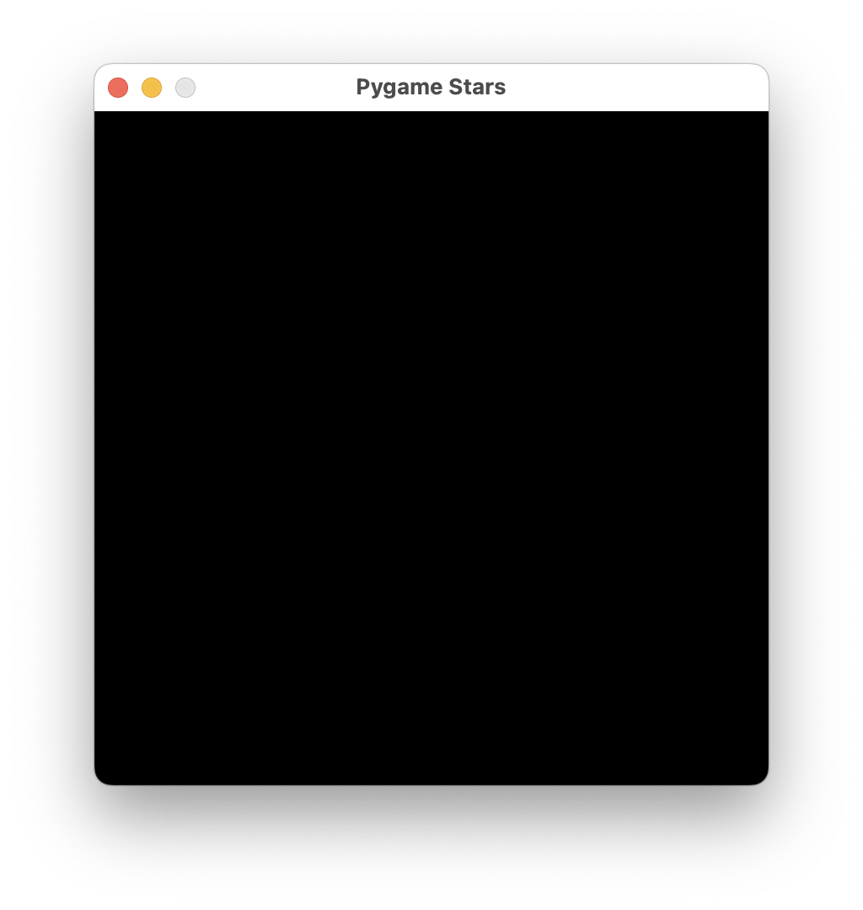
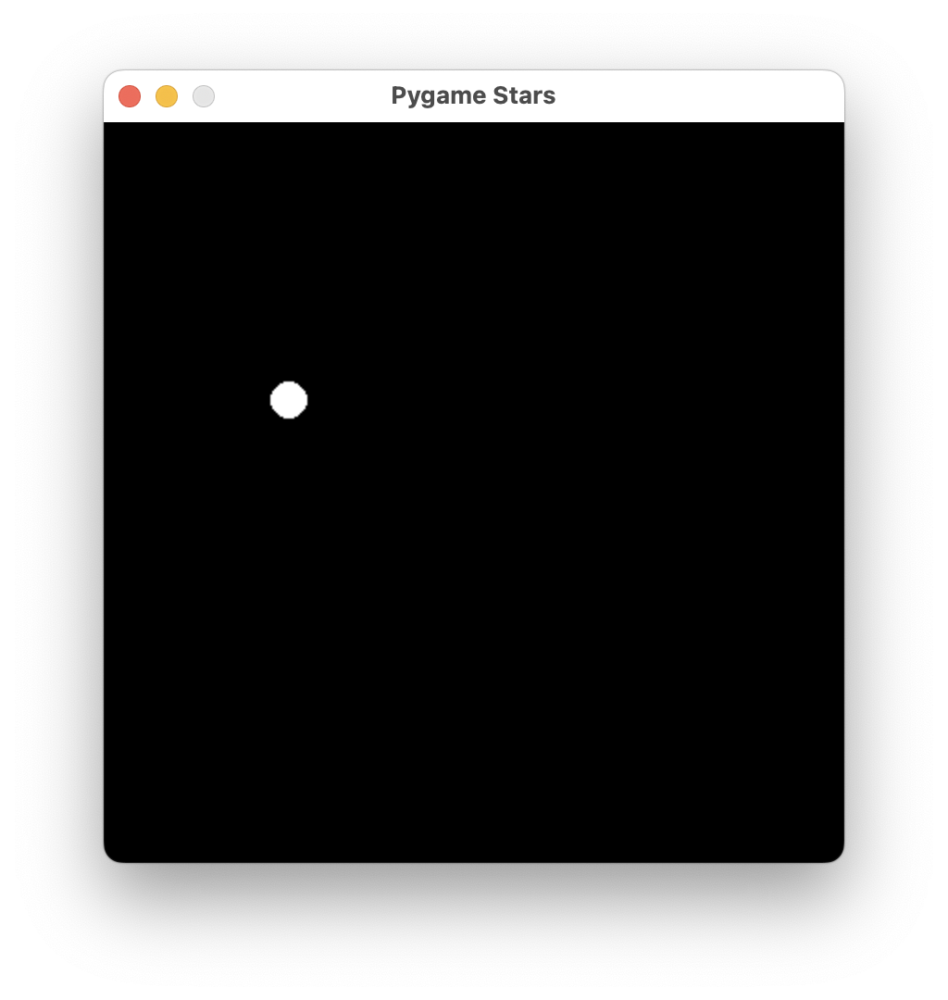

<link rel="stylesheet" href="../common/sheet.css">

<table class="key_info">
<tr><td class="difficulty">Difficulty: <b>🌶🌶</b><i>🌶🌶🌶</i></td>
<td>Language: Python</td>
<td>Requires: Laptop with Python, coderdojo [games]</td></tr>
</table>


Some inspiration text. A bit of background, and a link to the original project in github.
Focus on what is fun, what we will make and what we will learn.

This sheet recommends using Thonny in Python 3 mode.

## Starting up pygame

Pygame needs a couple of things to get started:

```python
import pygame

WIDTH=400
HEIGHT=400

pygame.init()
screen = pygame.display.set_mode((WIDTH, HEIGHT))
pygame.display.set_caption("Pygame Stars")

running = True
while running:
    for event in pygame.event.get():
        if event.type == pygame.QUIT:
            running = False
```

We've set a display size, you can adjust to something bigger if you like.
There's a caption, which is the text that appears in the window title bar.
The `running` variable is used to control the main loop, and the `for` loop is used to process events. Events are things like mouse clicks, key presses, and window close events.
At this point, this only handles closing the window.



## Drawing a star

Let's make a star by drawing a small circle.
Add the following code above the running loop:

```python
x = 100
y = 150
size = 10
pygame.draw.circle(screen, (255, 255, 255), (x, y), size)
```

Then after the main loop, add the following code:

```python
    pygame.display.update()
```

This draws a circle on the screen, with a white colour, at position (100, 150), and a size of 10.



### Checkpoint

At this point your code should look like this:

```python
import pygame

WIDTH=400
HEIGHT=400

pygame.init()
screen = pygame.display.set_mode((WIDTH, HEIGHT))
pygame.display.set_caption("Pygame Stars")

x = 100
y = 150
size = 10
pygame.draw.circle(screen, (255, 255, 255), (x, y), size)

running = True
while running:
    for event in pygame.event.get():
        if event.type == pygame.QUIT:
            running = False
    pygame.display.update()
```

## Drawing multiple stars

We will have many stars, so we'll group the parts of a star into a class. This will make it easier to draw many stars.

```python
class Star:
    def __init__(self, x, y, size):
        self.x = x
        self.y = y
        self.size = size

    def draw(self):
        pygame.draw.circle(screen, (255, 255, 255), (self.x, self.y), self.size)
```

