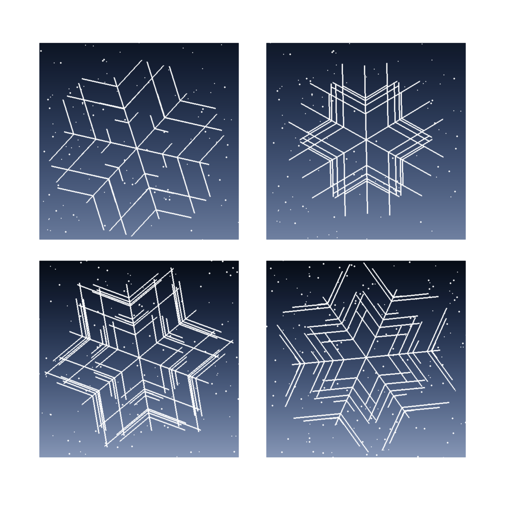

<div class="key-info">
<div>Difficulty: <span class="chillies">🌶🌶🌶</span><span class="remainingchillies">🌶🌶</span></div><div>Language: Python
</div><div>Requires: Laptop with Python, coderdojo [games] or pygame</div>
</div>

Sheet link:
![[qr-link.png|100]]

Let's use Python and Pygame to make snowflakes, different every time!

Please take care with names and case. Python is case sensitive, so `SnowFlake` is different to `snowflake`. If you get an error, check your spelling and capitalisation.

This sheet recommends using Thonny from <https://thonny.org> in Python 3 mode.

You do not need to type the whole example out again, only make changes where shown. Throughout this sheet we will use diff blocks to show you what changes we're making to code. Key:
```diff
+ this is a new line to add into your code
- this is a line to remove from your code
  and this is a line to leave the same.
```

Code for this sheet is at <https://github.com/coder-dojo-ham/coder-dojo-worksheets/tree/main/python/snowflake_generator>. 
## Step 1 - Setting up
Let's get ourselves a screen to draw on using PyGame. We'll collect some imports on the way too. In a new file add the following:

```python
import math

import pygame

WIDTH=400
HEIGHT=400
FPS = 60
WHITE = (255, 255, 255)
BLACK = (0, 0, 0)

pygame.init()
screen = pygame.display.set_mode((WIDTH, HEIGHT))
pygame.display.set_caption("Snowflake")

running = True
while running:
    for event in pygame.event.get():
        if event.type == pygame.QUIT:
            running = False
    screen.fill(BLACK)
    pygame.display.flip()
pygame.quit()
```
We will be using `math` to generate our snowflake and `pygame` to draw our snowflake.

We've set up variables for screen size and colours. We set up a screen with a title "Snowflake" and a background colour. We also set up a main loop to keep our game running until we close the window causing a quit event. Running this should give a black screen with a title. 
![[Screenshot 2023-11-18 at 19.53.17.png|400]]
Let's make it more interesting.
## Adding the skeleton of our snowflake
The basic part of our snowflake would be a line. Here we are adding code, so the little plus marks show which lines to add and where (do not type the plusses).

```diff
  import math
  
  import pygame
  
  WIDTH=400
  HEIGHT=400
  FPS = 60
  WHITE = (255, 255, 255)
  BLACK = (0, 0, 0)
  
+ class SnowFlake:
+     def draw(self, surface):
+         mid_x, mid_y = WIDTH/2, HEIGHT/2
+         pygame.draw.line(surface, WHITE, (mid_x, mid_y), (mid_x, mid_y-100))
  
  pygame.init()
  screen = pygame.display.set_mode((WIDTH, HEIGHT))
  pygame.display.set_caption("Snowflake")
  
+ snowflake = SnowFlake()
  
  running = True
  while running:
      for event in pygame.event.get():
          if event.type == pygame.QUIT:
              running = False
      screen.fill(BLACK)
+     snowflake.draw(screen)
      pygame.display.flip()
  pygame.quit()
```
This will get you a single line:

![[Screenshot 2023-11-18 at 19.53.47.png|400]]
The line drawing takes coordinates to start at, and coordinates to end at. Not much of a snowflake yet, but we can fix that.
## Spokes
We want to repeat drawing a line 6 times, for the spokes, turning each time.
Note we are extending our snowflake class, so only add/remove lines with plusses/minus in front. We can also have a flake size to control the size of our snowflake:
```diff
  BLACK = (0, 0, 0)
+ TURN_SIZE = math.pi / 3

 class SnowFlake:
+    flake_size = 100
     def draw(self, surface):
         mid_x, mid_y = WIDTH/2, HEIGHT/2
-        pygame.draw.line(surface, WHITE, (mid_x, mid_y), (mid_x, mid_y-100))
+        angle = 0
+        for n in range(6):
+            pygame.draw.line(surface, WHITE, (mid_x, mid_y), 
+               (mid_x + math.cos(angle)*self.flake_size, 
+                mid_y + math.sin(angle)*self.flake_size))
+            angle += TURN_SIZE
```
A full circle is `2*pi`. `TURN_SIZE` is 1/6 of a circle or `pi * 2/6`, which becomes `pi/3`.
This should get you spokes of a snowflake.
![[image_4_spokes.png|400]]
We are using `cos` and `sin` to find the end of the line, think of these as making a point on a circle of size 1, we multiply by flake size to make it the right length, and add the mid point to move it to the right place.
## Using flake size to add more
Our snow flake is still a bit boring, we need some branches.
```diff
   TURN_SIZE = math.pi / 3

+ class Branch:
+     distance = 1/2
+     size = 1/4
+
+     def draw(self, surface, mid_x, mid_y, angle, branch_angle, flake_size):
+          scaled_distance = flake_size * self.distance
+          scaled_size = flake_size * self.size
+          x = mid_x + math.cos(angle) * scaled_distance
+          y = mid_y + math.sin(angle) * scaled_distance
+          x2 = x + math.cos(angle + branch_angle) * scaled_size
+          y2 = y + math.sin(angle + branch_angle) * scaled_size
+          pygame.draw.line(surface, WHITE, (x, y), (x2, y2))

  class SnowFlake:
-     flake_size = 100
+     def __init__(self, flake_size = 100):
+         self.flake_size = flake_size
+         self.branch = Branch()

      def draw(self, surface):
         mid_x, mid_y = WIDTH/2, HEIGHT/2
         pygame.draw.line(surface, WHITE, (mid_x, mid_y), (mid_x, mid_y-100))
         angle = 0
         for n in range(6):
             pygame.draw.line(surface, WHITE, (mid_x, mid_y), 
                (mid_x + math.cos(angle)*self.flake_size, 
                 mid_y + math.sin(angle)*self.flake_size))
+            self.branch.draw(surface, mid_x, mid_y, angle, TURN_SIZE, self.flake_size)
             angle += TURN_SIZE
```
We have added a branch, with a distance (from the middle) and size scaled by the `flake_size`. We draw it for each turn, so the snowflake has 6 sided symmetry.
![[image_5_branches.png|400]]
This is a bit one-sided, we can add the other side with 1 line of code:
```diff
         for n in range(6):
             pygame.draw.line(surface, WHITE, (mid_x, mid_y), 
                (mid_x + math.cos(angle)*self.flake_size, 
                 mid_y + math.sin(angle)*self.flake_size))
             self.branch.draw(surface, mid_x, mid_y, angle, TURN_SIZE, self.flake_size)
+            self.branch.draw(surface, mid_x, mid_y, angle, -TURN_SIZE, self.flake_size)
             angle += TURN_SIZE
```
This is starting to look like a snowflake!
![[image_6_snowflake.png|400]]
## Checkpoint
At this stage, your code should look like this [[stage_5.py]]:
```python
import math
  
import pygame
  
WIDTH=400
HEIGHT=400
FPS = 60
WHITE = (255, 255, 255)
BLACK = (0, 0, 0)
TURN_SIZE = math.pi / 3

class Branch:
  distance = 1/2
  size = 1/4

  def draw(self, surface, mid_x, mid_y, angle, branch_angle, flake_size):
       scaled_distance = flake_size * self.distance
       scaled_size = flake_size * self.size
       x = mid_x + math.cos(angle) * scaled_distance
       y = mid_y + math.sin(angle) * scaled_distance
       x2 = x + math.cos(angle + branch_angle) * scaled_size
       y2 = y + math.sin(angle + branch_angle) * scaled_size
       pygame.draw.line(surface, WHITE, (x, y), (x2, y2))


class SnowFlake:
    def __init__(self, flake_size = 100):
        self.flake_size = flake_size
        self.branch = Branch()

    def draw(self, surface):
        mid_x, mid_y = WIDTH/2, HEIGHT/2
        angle = 0
        for n in range(6):
            pygame.draw.line(surface, WHITE, (mid_x, mid_y), 
               (mid_x + math.cos(angle) * self.flake_size, 
                mid_y + math.sin(angle) * self.flake_size))
            self.branch.draw(surface, mid_x, mid_y, angle, TURN_SIZE, self.flake_size)
            self.branch.draw(surface, mid_x, mid_y, angle, -TURN_SIZE, self.flake_size)
            angle += TURN_SIZE
  
pygame.init()
screen = pygame.display.set_mode((WIDTH, HEIGHT))
pygame.display.set_caption("Snowflake")
  
snowflake = SnowFlake()
  
running = True
while running:
    for event in pygame.event.get():
        if event.type == pygame.QUIT:
            running = False
    screen.fill(BLACK)
    snowflake.draw(screen)
    pygame.display.flip()
pygame.quit()
```
## Thicker lines
We can make this a bit less "stringy", by having thicker lines. make the following changes near the top of the file:
```diff
  WHITE = (255, 255, 255)
  BLACK = (0, 0, 0)
  TURN_SIZE = math.pi / 3
+ PEN_WIDTH = 3
```
Then in Branch draw:
```diff
        x2 = x + math.cos(angle + branch_angle) * scaled_size
        y2 = y + math.sin(angle + branch_angle) * scaled_size
-       pygame.draw.line(surface, WHITE, (x, y), (x2, y2))
+       pygame.draw.line(surface, WHITE, (x, y), (x2, y2), PEN_WIDTH)
```
And in SnowFlake draw:
```diff
      def draw(self, surface):
          mid_x, mid_y = WIDTH/2, HEIGHT/2
          angle = 0
          for n in range(6):
              pygame.draw.line(surface, WHITE, (mid_x, mid_y), 
                 (mid_x + math.cos(angle)*self.flake_size, 
-                 mid_y + math.sin(angle)*self.flake_size))
+                 mid_y + math.sin(angle)*self.flake_size), PEN_WIDTH)
              self.branch.draw(surface, mid_x, mid_y, angle, TURN_SIZE, self.flake_size)
              self.branch.draw(surface, mid_x, mid_y, angle, -TURN_SIZE, self.flake_size)
              angle += TURN_SIZE
```
This thicker line makes it a bit nicer.
## Making it random
The snowflake is always the same. We wanted it a bit more random. We'll start with the branch distance and size.  First we need to import random:
```diff
  import math
+ import random
```
Now we can use this to make our branch different each time:
```diff
  class Branch:
-     distance = 1/2
-     size = 1/4
+     def __init__(self):
+         self.distance = 1/ random.randint(1, 10)
+         self.size = 1 / random.randint(1, 10)
```
The arm will be a different length and size each time.
![[stage_7_shots/1.png|300]] ![[stage_7_shots/2.png|300]] !
## Randomising the branch count
We can also randomise the number of branches. We can do this by changing the range in the for loop.
```diff
  class SnowFlake:
      def __init__(self, flake_size = 100):
          self.flake_size = flake_size
-         self.branch = Branch()
+         self.branches = [Branch() for _ in range(random.randint(3, 10))]
```
We need to update drawing:
```diff
          for n in range(6):
              pygame.draw.line(surface, WHITE, (mid_x, mid_y), 
                 (mid_x + math.cos(angle)*self.flake_size, 
                 mid_y + math.sin(angle)*self.flake_size), width=PEN_WIDTH)
-              self.branch.draw(surface, mid_x, mid_y, angle, TURN_SIZE, self.flake_size)
-              self.branch.draw(surface, mid_x, mid_y, angle, -TURN_SIZE, self.flake_size)
+             for branch in self.branches:
+                 branch.draw(surface, mid_x, mid_y, angle, TURN_SIZE, self.flake_size)
+                 branch.draw(surface, mid_x, mid_y, angle, -TURN_SIZE, self.flake_size)
              angle += TURN_SIZE
```
Run this and you should get images like these:
![[stage_8_shots/2.png|300]] ![[stage_8_shots/3.png|300]]
You have a random snowflake generator!
## Checkpoint
```python
import math
import random

import pygame

WIDTH=400
HEIGHT=400
FPS = 60
WHITE = (255, 255, 255)
BLACK = (0, 0, 0)
TURN_SIZE = math.pi / 3
PEN_WIDTH = 3

class Branch:
    def __init__(self):
        self.distance = 1/ random.randint(1, 10)
        self.size = 1 / random.randint(1, 10)

    def draw(self, surface, mid_x, mid_y, angle, branch_angle, flake_size):
        scaled_distance = flake_size * self.distance
        scaled_size = flake_size * self.size
        x = mid_x + math.cos(angle) * scaled_distance
        y = mid_y + math.sin(angle) * scaled_distance
        x2 = x + math.cos(angle + branch_angle) * scaled_size
        y2 = y + math.sin(angle + branch_angle) * scaled_size
        pygame.draw.line(surface, WHITE, (x, y), (x2, y2), PEN_WIDTH)


class SnowFlake:
    def __init__(self, flake_size = 100):
        self.flake_size = flake_size
        self.branches = [Branch() for _ in range(random.randint(3, 10))]

    def draw(self, surface):
        mid_x, mid_y = WIDTH/2, HEIGHT/2
        angle = 0
        for n in range(6):
            pygame.draw.line(surface, WHITE, (mid_x, mid_y), 
                (mid_x + math.cos(angle)*self.flake_size, 
                mid_y + math.sin(angle)*self.flake_size), PEN_WIDTH)
            for branch in self.branches:
                branch.draw(surface, mid_x, mid_y, angle, TURN_SIZE, self.flake_size)
                branch.draw(surface, mid_x, mid_y, angle, -TURN_SIZE, self.flake_size)
            angle += TURN_SIZE

pygame.init()
screen = pygame.display.set_mode((WIDTH, HEIGHT))
pygame.display.set_caption("Snowflake")

snowflake = SnowFlake()

running = True
while running:
    for event in pygame.event.get():
        if event.type == pygame.QUIT:
            running = False
    screen.fill(BLACK)
    snowflake.draw(screen)
    pygame.display.flip()
pygame.quit()
```
## Extension ideas
### Making a background
These look great, but we can add a background in, some sky?
Add this in the imports:
```diff
+ import colorsys
  import math
  import random
```
We are going to make a sweeping Sky, colorsys lets us make gradients in python, where we can go between a light and dark blue:
```diff
+ def make_background(surface):
+     light_per_row = 0.8 / HEIGHT
+     # Get a blue hue
+     hue = 0.6
+     for y in range(HEIGHT):
+         light = light_per_row * y
+         hsv = colorsys.hsv_to_rgb(hue, 0.1 + 0.7 * (1 - light), light)
+         color = [int(255 * c) for c in hsv]
+         pygame.draw.line(surface, color, (0, y), (WIDTH, y))

  pygame.init()
```
We then use this to make a background we can draw:
```diff
  pygame.display.set_caption("Snowflake")

+ background = pygame.Surface((WIDTH, HEIGHT))
+ make_background(background)
  snowflake = SnowFlake()
```
And then we can draw it in our main loop:
```diff
-     screen.fill(BLACK)
+     screen.blit(background, (0, 0))
      snowflake.draw(screen)
```

A hue makes a particular colour, with 0.6 being a nice blue (you can try other values between 0 and 1 for fun). We'll make the light value go between 0 and 0.8, so it's not too bright to see the snowflake. We divide this by screen HEIGHT so we have a factor to change it by going down the screen.
![[Screenshot 2023-11-18 at 19.45.51.png|400]]
The for loop goes down each row of pixels, calculates a light value, and uses this to make HSV (hue, saturation, value) colour for each row. The saturation means how vivid a colour is between a grey and a very deep blue. We alter this by the light a little too so the sky goes a bit white.
### Background snow
We can also have some background snow in our scene:
```diff
          color = [int(255 * c) for c in hsv]
          pygame.draw.line(surface, color, (0, y), (WIDTH, y))
+     for n in range(300):
+         x = random.randint(0, WIDTH)
+         y = random.randint(0, HEIGHT)
+         pygame.draw.circle(surface, WHITE, (x, y), 1)
```
We draw 300 stars at random positions. You can make them bigger with the number at the end of the circle line, or change the number of them.
![[Screenshot 2023-11-18 at 19.50.58.png|400]]
### More ideas
- If we pass in a facing to Snowflake.draw (instead of 0), and update it every frame in the main loop by some fraction (0.01), we could animate it so it rotates.
- You could add more than one snow flake and draw them - `snowflake2 = SnowFlake()`. You might need to change where it's mid point is though.
- You could have the size and distance on the branches change a little bit, updating them every frame, so the snowflake changes and morphs.