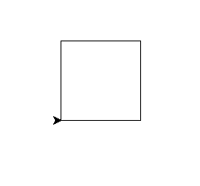
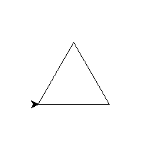
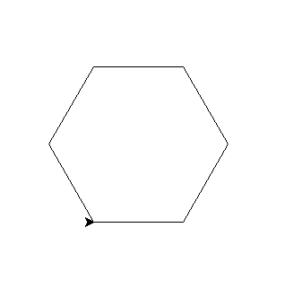
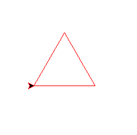
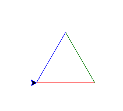
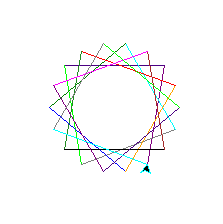
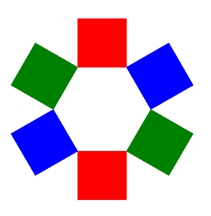

# Turtle, Python sheet 1

## Start up python

Start 'IDLE' and open a new window to write code in. 

### Quick recap

You've already seen variables, and printing. Try these in the shell:

    >>> a = 1
    >>> print(a)
    1
    >>> b= a + 5
    >>> b
    6

## Basic turtle commands

For quick reference - here are some of the commonly used turtle commands:

|                  |             |
|------------------|-------------|
| turtle.forward   | Go forward  |
| turtle.backward  | Go backward |
| turtle.right     | Turn right  |
| turtle.left      | Turn left   |
| 	                             |
| turtle.penup()   | Lifts the pen up so you can move the turtle without drawing |
| turtle.pendown() | Drops the pen back onto the screen so you  can draw |
| turtle.fillcolor(“Brown”) | Changes the fill colour to brown (or other colour) |
| turtle.pencolor(“Red”)    | Changes the pen colour to red (or other colour) |
| turtle.begin_fill()       | Begins to fill the shape |
| turtle.end_fill()         | End the filling sequence |

## Warm up - Squares in turtle

In the editor, type this code:

    import turtle

    for n in range(4):
        turtle.forward(100)
        turtle.left(90)

When you save and run, you'll get something like this:

Or perhaps a triangle, in a new file try this:

    import turtle

    for n in range(3):
        turtle.forward(100)
        turtle.left(120)

Now if I told you that a Hexagon has 6 sides, and it needs to turn left by 60, can you write code that does this?

Lets make this a bit more interesting though - these are all very nice, but not too colourful. In one of the examples before (I chose triangle), add pen colour before the loop:

    turtle.pencolor("red")

    for n in range(3):
        turtle.forward(100)
        turtle.left(120)

## More colours 

There is a "gotcha" here - turtle spells colour without a "u"!

In your last example, change the loop to this:

    trianglecolours = ["red", "green", "blue"]
    for colour in trianglecolours:
        turtle.pencolor(colour)
        turtle.forward(100)
        turtle.left(120)

## Using colours more than once

Try this in the shell. You can make any list you want:

    >>> shopping_list = ["eggs", "milk", "cheese"]
    >>> shopping_list * 2
    ["eggs", "milk", "cheese", "eggs", "milk", "cheese"]

You can then do the same when drawing from a list of colours:

    import turtle

    myshape = ["red", "blue", "yellow"] * 2

    for colour in myshape:
        turtle.pencolor(colour)
        turtle.forward(100)
        turtle.left(60)

How many sides are there? Could you use the same to make an octagon? turn left by 45, it has 8 sides.

### Colour names

"green", "blue", "orange", "red", "yellow", "white", "black", "brown", "magenta", "purple", "indigo", "lime", "gray", "cyan". 

There are actually many thousands of colours possible. See http://www.science.smith.edu/dftwiki/index.php/Color_Charts_for_TKinter for a HUGE list.

## More shapes

If you modify the number of times you multiply the colours, and the number by which the turtle turns, you can create many different colourful shapes.

## Fancier shapes

So these shapes are all a bit, well flat and possibly boring. 
So how can we do more interesting stuff?

Python has functions, which give a name to a bit of code. Every time you use that name, with some brackets "()", you tell it to use that named code again.

    def square():
        for n in range(4):
            turtle.forward(100)
            turtle.left(90)

    for n in range(6):
        square()
        turtle.forward(100)
        turtle.right(60)

And combine with the colour lists to make it colourful:

    colours = ["red", "blue", "green"] * 2
    for colour in colours:
        turtle.pencolor(colour)
        square()
        turtle.forward(100)
        turtle.right(60)

If we change it so they are filled this gets even more fun:

    def square():
        turtle.begin_fill()
        for n in range(4):
            turtle.forward(100)
            turtle.left(90)
        turtle.end_fill()

    colours = ["red", "blue", "green"] * 2
    for colour in colours:
        turtle.pencolor(colour)
        turtle.fillcolor(colour)
        square()
        turtle.forward(100)
        turtle.right(60)

    import turtle 

    star = turtle.Turtle()

    for i in range(50):
        star.forward(50)
        star.right(144)
        
    turtle.done()