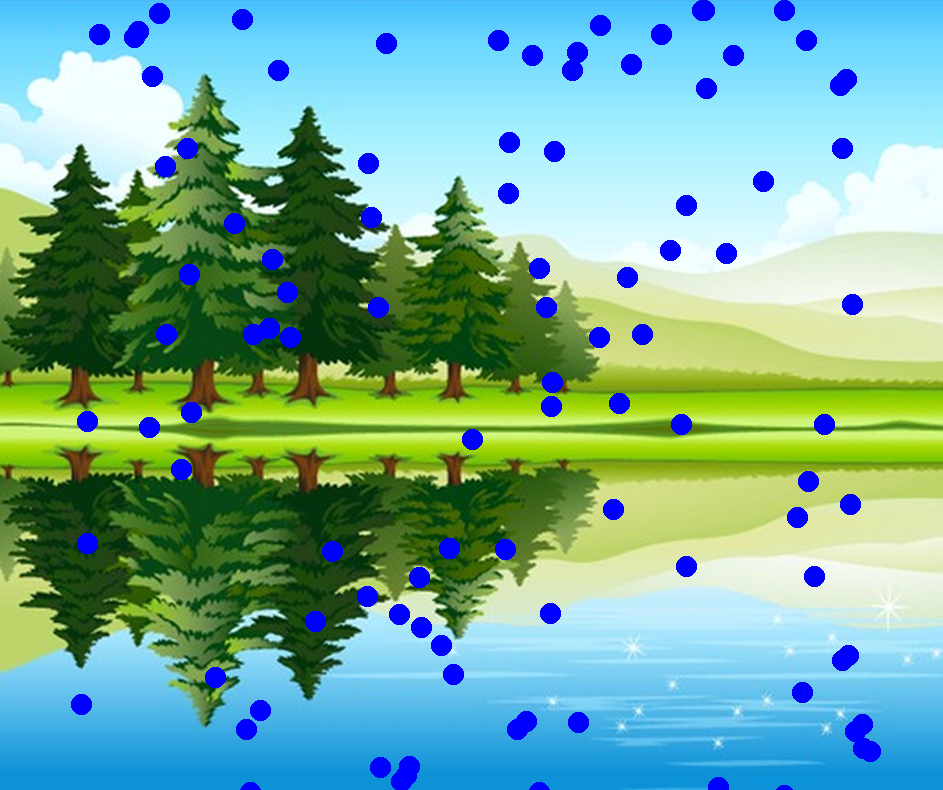
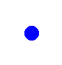

<style>
    h2 {
        page-break-before: always;
    }
   table.key_info {
    	width: 100%;
	}
    table.key_info, .key_info td {
    	background-color: blue;
    	color: white;
	}
	@media print {
	  pre, blockquote {page-break-inside: avoid;}
	  h3 { page-break-after: avoid; }
	}
</style>

# Python Turtle Raindrops

<table class="key_info">
<tr><td>Level: Intermediate</td>
<td>Language: Python</td>
<td>Requires: Laptop with Python</td></tr>
</table>



We'll use python and turtle to make it rain. Once you've got it raining,
have a go at making other things move around on the screen.

The drops could be snow, stars, faces or footballs.

We'll use some elements you've seen - variables, random numbers
and functions.

We'll be introducing one new element - lists.

And you'll get to do some simple animation! Stuff that moves!

This sheet recommends using Mu in Python 3 mode.


<!-- -- id="draw-raindrop" -->
## Drawing a raindrop

Lets start by setting up turtle to draw fast with `speed(0)`, hide the turtle with `hideturtle`, and pull up the pen with `penup`.

```python
import turtle

t = turtle.Turtle()

t.speed(0)
t.hideturtle()
t.penup()
```

To draw a simple drop we can use a blue circle.



```python
t.shape("circle")
t.color("blue")

t.goto(0, 0)
t.stamp()
```

`t.shape` changes the turtles shape, `t.goto` jumps to a set of coordinates.
By using `t.stamp`, we can leave behind a stamp, an image of the turtles current shape on the canvas where it stands.

Try running this.

## Drawing multiple drops

We are going to want to stamp a blue circle many times - so let's move the drawing code into a function:

<pre><code><del>t.goto(0, 0)
t.stamp()
</del></code></pre>

```python
def draw_drop(x, y):
    t.goto(x, y)
    t.stamp()

draw_drop(0, 0)
draw_drop(30, -40)
draw_drop(50, 20)
```

`x` is how far across the screen from the left, `y` is how far up the screen from the bottom.
There is a negative number there. This is because `0, 0` is the middle of screen - so to go further down, or left, we need to subtract from `0` to get there. When you run this, it should draw 3 raindrops.


## More rain
<!-- -- id="more-rain" -->
There are many raindrops in rain. Let's use a list to hold them:

<pre><code><del>draw_drop(0, 0)
draw_drop(30, -40)
draw_drop(50, 20)
</del></code></pre>

```python
drops = [[0, 0], [30, -40], [50, 20]]

for drop in drops:
    draw_drop(drop[0], drop[1])
```

Drops is a list of (x,y) pairs - each a small list too. When we draw this - x is drop[0] and y is drop[1]. This should show the same 3 drops as before, but you can change the list to add more drops.

---

Now we can make the list bigger. Let's add 100 raindrops using `random` to scatter them around the screen. First we need to import random at the top of our code:
<pre><code>
    import turtle
    <b>import random</b>
</pre></code>

Then we replace our fixed list with an empty list, and fill it with random drop positions:

<pre><code><del>drops = [[0, 0], [30, 40], [50, 20]]
</del></code></pre>

```python
drops = []
for n in range(100):
    drop = [random.randint(-400, 400), random.randint(-400, 400) ]
    drops.append( drop )
```


Each time you run it - you'll get different drops!

## Preparing to animate
<!-- -- id="prep-animate" -->

You may have noticed that drawing the drops was a bit slow - one drop at a time. If we are going to animate this, we need to be able to draw a lot faster. Add the bold line near the top of the file.
Note that this should be `turtle` and not `t`.
<pre><code>
import turtle
import random
<b>turtle.tracer(0, 0)</b>
</pre></code>

This tells the turtle not to animate itself, so we can animate instead.
This will be very quick, but it's actually drawn on a background/hidden screen. To actually see it you'll need to add this at the end of the code:

```python
turtle.update()
```

This will now make the random raindrops draw much faster.

## Moving the raindrops

We can start to make these raindrops move now.

```python
import turtle
import random

turtle.tracer(0, 0)
t = turtle.Turtle()
t.speed(0)
t.hideturtle()
t.penup()
t.shape("circle")
t.color("blue")

def draw_drop(x, y):
    t.goto(x, y)
    t.stamp()

drops = []
for n in range(100):
    drop = [random.randint(-400, 400), random.randint(-400, 400) ]
    drops.append( drop )

while True:
    t.clear()
    for drop in drops:
        drop[1] -= 3
        draw_drop(drop[0], drop[1])
    turtle.update()
```

Our animation is in the while loop. It clears the drawings, then moves them down by 3 (subtracting 3 from Y), and draws the drop.

After drawing all drops, we update the screen. This makes a different picture every time, which will look like the drops are moving.

You'll note all the drops fall off the screen here. You may see an "invalid command name" and a large number when you close the window, don't worry - this can be ignored for now.

## Rain from the top again

We can stop them falling off. The bottom of the screen here is -400. So if we are below that, we can put them back at the top. Add the following in the loop after we subtract 3 from the drop y:

```python
    if drop[1] < -400:
      drop[1] = 400
```

## Ideas to try

<!-- -- id="ideas" -->

### Try changing the draw_drop function

You can put the pen down and do standard turtle drawing commands. Or you could use a GIF image.

```diff
- t.shape("circle")
- t.color("blue")

+ screen = turtle.Screen()
+ image = "myimage.gif"
+ screen.addshape(image)
+ t.shape(image)
```

Now when you stamp - it will be your image instead of the circles. Happy faces? Spaceships? Stars? You could just use the turtle command `t.dot()` to do a single dot instead of stamping with the pen down.

### Try adding a 3rd parameter

You can try using a 3rd item in the lists - for speed, or raindrop size (t.shapesize, or as a parameter for dot).

When creating the drop, we can try a number between 2 and 4:

```diff
 for n in range(100):
+    drop = [random.randint(-400, 400), random.randint(-400, 400), random.randint(2,4) ]
     drops.append( drop )

```

You can then use this 3rd parameter for speed instead of -3:

```diff
     for drop in drops:
+        drop[1] -= drop[2]
         if drop[1] < -400:
             drop[1] = 400
```

This now moves different drops at different speeds, giving a feeling of depth.

### Background images

You can use a GIF as a background image:

```python
    screen = turtle.Screen()
    screen.bgpic("mybackground.gif")
```

## Inspiration

<!-- -- id="inspiration" -->

```python
import turtle
import random

screen = turtle.Screen()
screen.bgpic("lake-background.gif")

turtle.tracer(0, 0)
t = turtle.Turtle()
t.speed(0)
t.hideturtle()
t.penup()
t.shape("circle")
t.color("blue")

def draw_drop(x, y):
    t.goto(x, y)
    t.stamp()

drops = []
for n in range(100):
    drop = [random.randint(-400, 400), random.randint(-400, 400) ]
    drops.append( drop )

while True:
    t.clear()
    for drop in drops:
        drop[1] -= 3
        if drop[1] < -400:
            drop[1] = 400
        draw_drop(drop[0], drop[1])
    turtle.update()
```


## Turtle Colours

<!-- -- id="colours" -->

This is a limited list. Look up "TK colours" for more names. You can also use three numbers for red, green and blue to mix your
own colours: `t.color((172, 38, 53))` <span style="background: rgb(172, 38, 53)">Sample</span>.

<table>
<thead><tr><th>Colour Name</th><th>Sample</th></tr></thead>
<tbody>
    <tr><td>red</td><td style="background: red">&nbsp;</td></tr>
    <tr><td>blue</td><td style="background: blue">&nbsp;</td></tr>
    <tr><td>green</td><td style="background: green">&nbsp;</td></tr>
    <tr><td>yellow</td><td style="background: yellow">&nbsp;</td></tr>
    <tr><td>salmon</td><td style="background: salmon">&nbsp;</td></tr>
    <tr><td>orange</td><td style="background: orange">&nbsp;</td></tr>
    <tr><td>black</td><td style="background: black">&nbsp;</td></tr>
    <tr><td>white</td><td style="background: white">&nbsp;</td></tr>
</tbody>
</table>

Its worth trying other colour names and seeing what works.

## Turtle reference

Command                | Effect
---------------------- | ----------------------------------------------
`t = turtle.Turtle()`  | Make a turtle called t
`turtle.tracer(0,0)`   | Turn off tracer animation - makes it very fast
`turtle.update()`      | Make a screen update - handy when fast
`turtle.done()`        | Program finished, wait for window to close
`t.clear()`            | Clear everything drawn by this turtle
`t.speed(0)`           | Make this turtle fast
`t.penup()`            | Pull the pen up - don't draw lines
`t.pendown()`          | Put the pen down - draw a line
`t.hideturtle()`       | Hide the turtle - don't draw it
`t.goto(x, y)`         | Jump to position x, y. 0, 0 is the middle
`t.stamp()`            | Stamp the current turtle shape
`t.shape("shape")`     | Change shape. Try "turtle", "circle", "square"
`t.color("color")`     | Change color. Try "red", "green", "blue"
`t.forward(100)`       | go forward 100 pixels
`t.left(90)`           | turn left 90 degrees
`t.right(45)`          | turn right 45 degrees
