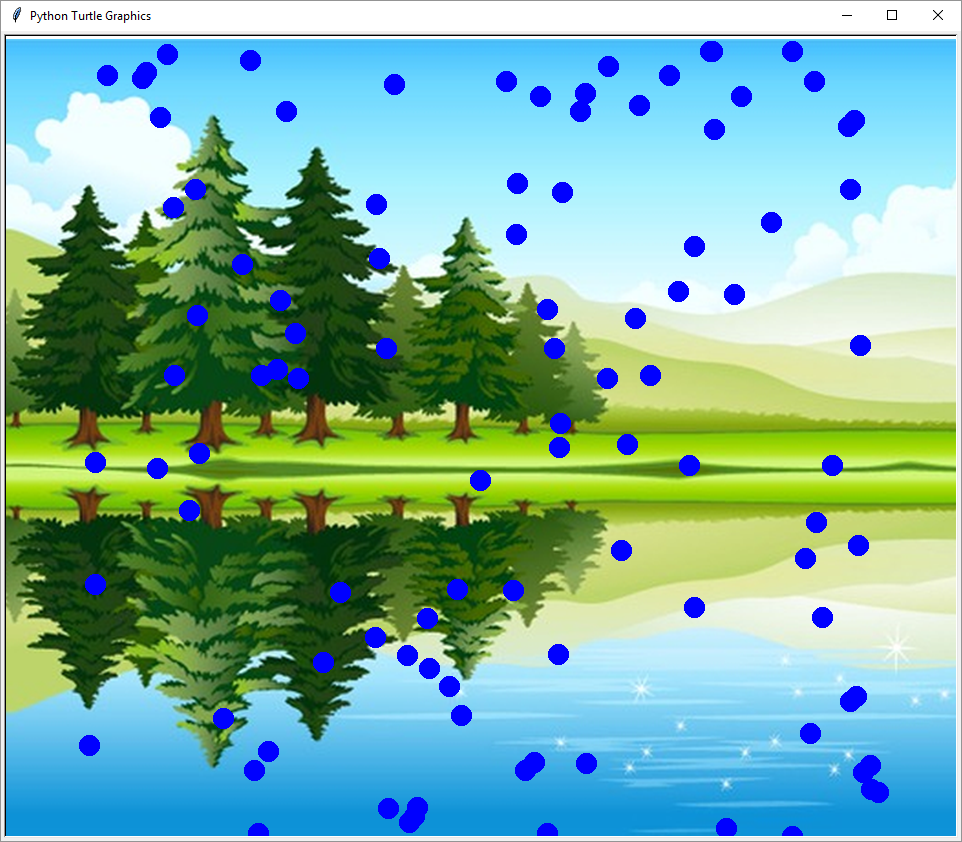
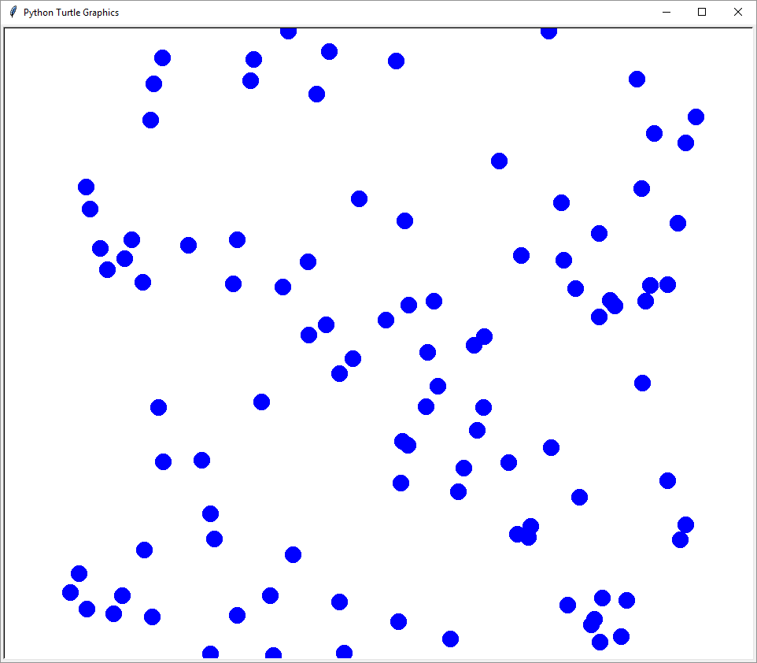

# Raindrops

We'll use python and turtle to make it rain. Once you've got it raining, 
have a go at making other things move around on the screen.

Could be snow, stars, faces or other stuff.

We'll use some elements you've seen - variables, random numbers
and functions.

We'll be introducing one new element - lists.

And you'll get to do some simple animation! Stuff that moves!

---
<!-- -- id="setup" -->
# Setting Up

Pull up a python editor (we prefer IDLE), and create a new window.
Put the empty document next to the python shell window like below.

---

# Turtle reference

| Command             | Effect                                         |
|---------------------|------------------------------------------------|
| t = turtle.Turtle() | Make a turtle called t                         |
| turtle.tracer(0,0)  | Turn off tracer animation - makes it very fast |
| turtle.update()     | Make a screen update - handy when fast         |
| turtle.done()       | Program finished, wait for window to close     |
| t.clear()           | Clear everything drawn by this turtle          |
| t.speed(0)          | Make this turtle fast                          |
| t.penup()           | Pull the pen up - dont draw lines              |
| t.pendown()         | Put the pen down - draw a line                 |
| t.hideturtle()      | Hide the turtle - don't draw it                |
| t.goto(x, y)        | Jump to position x, y. 0, 0 is the middle      |
| t.stamp()           | Stamp the current turtle shape                 |
| t.shape("shape")    | Change shape. Try "turtle", "circle", "square" |
| t.color("color")    | Change color. Try "red", "green", "blue"       |
| t.forward(100)      | go forward 100 pixels                          |
| t.left(90)          | turn left 90 degrees                           |
| t.right(45)         | turn right 45 degrees                          |

---
<!-- -- id="draw-raindrop" -->
# Drawing a raindrop

Lets start by setting up turtle to draw fast with `speed(0)`, hide the turtle with `hideturtle`, and pull up the pen with `penup`.

    import turtle

    t = turtle.Turtle()

    t.speed(0)
    t.hideturtle()
    t.penup()

To draw a simple drop we can use a blue circle.

    t.shape("circle")
    t.color("blue")

    t.goto(0, 0)
    t.stamp()

`t.shape` changes the turtles shape, `t.goto` jumps to a set of coordinates. 
By using `t.stamp`, we can leave behind a stamp, an image of the turtles current shape on the canvas where it stands.

We are going to want to stamp a blue circle many times - so lets move the drawing code into a function:
<pre><code><del>    t.shape("circle")
    t.color("blue")

    t.goto(0, 0)
    t.stamp()</del></code></pre>

    def draw_drop(x, y):
        t.shape("circle")
        t.color("blue")
        t.goto(x, y)
        t.stamp()
    
    draw_drop(0, 0)
    draw_drop(30, -40)
    draw_drop(50, 20)

x is how far across the screen from the left, y is how far up the screen from the bottom.
There is a negative number there. This is because 0, 0 is the middle of screen - so to go further down, or left, we need to subtract from 0 to get there.

---
# More rain
<!-- -- id="more-rain" -->
There are many raindrops in rain. We can make a list with some, and then draw the list

<pre><code><del>    draw_drop(0, 0)
    draw_drop(30, -40)
    draw_drop(50, 20)</del></code></pre>

    drops = [[0, 0], [30, 40], [50, 20]]
    
    for drop in drops:
        draw_drop(drop[0], drop[1])

Drops is a list of (x,y) pairs - each a small list too. When we draw this - x is drop[0] and y is drop[1].
Now we can make the list bigger. 100 raindrops - and use `random` to make them all over the place. First we need to import it (at the top):
<pre><code>
    import turtle
    <b>import random</b>
</pre></code>

So instead fo a fixed list, we start with an empty list, and fill it with random drop positions.

<pre><code><del>    drops = [[0, 0], [30, 40], [50, 20]]
</del></code></pre>
    drops = []
    for n in range(100):
        drop = [random.randint(-400, 400), random.randint(-400, 400) ]
        drops.append( drop )

---

Each time you run it - you'll get different drops!

---
# Preparing to animate
<!-- -- id="prep-animate" -->

You may have noticed that was a bit slow - a drop at a time. If we are going to animate this, we need to be able to draw a lot faster than that. Add the bold line near the top of the file.
Note that this should be `turtle` and not `t`.
<pre><code>
    import turtle
    import random

    <b>turtle.tracer(0, 0)</b>
</pre></code>

This will be very quick, but it's actually drawn on a background/hidden screen. To actually see it you'll need to add this at the end of the code:

    turtle.update()

This does exactly the same - but much faster. Nothing is actually updated until `turtle.update()` is called.

---
# Moving them

We can start to make these raindrops move now.

    import turtle
    import random

    turtle.tracer(0, 0)
    t = turtle.Turtle()
    t.speed(0)
    t.hideturtle()
    t.penup()

    def draw_drop(x, y):
        t.shape("circle")
        t.color("blue")
        t.goto(x, y)
        t.stamp()

    drops = []
    for n in range(100):
        drop = [random.randint(-400, 400), random.randint(-400, 400) ]
        drops.append( drop )
    
    while True:
        t.clear()
        for drop in drops:
            drop[1] -= 3
            draw_drop(drop[0], drop[1])
        turtle.update()

The while loop starts by clearing the drawings, then for each drop, we take away 3 from its Y, how high it is from the bottom.
We draw the drop.
After drawing the drops, we update the screen in the loop. That way - we get a different picture every time the loop runs, which will look like the drops are moving.

You'll note all the drops fall off the screen here. You may see an "invalid command name" and a large number when you close the window, don't worry - this can be ignored for now.
---
# Rain from the top again

We can stop them falling off. The bottom of the screen here is -400. So if we are below that, we can put them back at the top.

    import turtle
    import random

    turtle.tracer(0, 0)
    t = turtle.Turtle()
    t.speed(0)
    t.hideturtle()
    t.penup()

    def draw_drop(x, y):
        t.shape("circle")
        t.color("blue")
        t.goto(x, y)
        t.stamp()

    drops = []
    for n in range(100):
        drop = [random.randint(-400, 400), random.randint(-400, 400) ]
        drops.append( drop )
    
    while True:
        t.clear()
        for drop in drops:
            drop[1] -= 3
            if drop[1] < -400:
                drop[1] = 400
            draw_drop(drop[0], drop[1])
        turtle.update()

---
# Ideas to try
<!-- -- id="ideas" -->

## Try changing the draw_drop function. 

You can put the pen down and do standard turtle drawing commands. Or you could use a GIF image.

    screen = turtle.Screen()
    image = "myimage.gif"
    screen.addshape(image)
    t.shape(image)

Now when you stamp - it will be your image instead of the circles. Happy faces? Spaceships? Stars? You could just use the turtle command `t.dot()` to do a single dot instead of stamping with the pen down.

## Try adding a 3rd parameter

You can try using a 3rd item in the lists - for speed, or raindrop size (t.shapesize, or as a parameter for dot). For speed - you could use drop[2] with:

    drop[1] -= drop[2]

You would make it a randint like the other 2.

## Background images

You can use a GIF as a background image:

    screen = turtle.Screen()
    screen.bgpic("mybackground.gif")
---
# Inspiration
<!-- -- id="inspiration" -->

    import turtle
    import random

    screen = turtle.Screen()
    screen.bgpic("lake-background.gif")

    turtle.tracer(0, 0)
    t = turtle.Turtle()
    t.speed(0)
    t.hideturtle()
    t.penup()

    def draw_drop(x, y):
        t.shape("circle")
        t.color("blue")
        t.goto(x, y)
        t.stamp()

    drops = []
    for n in range(100):
        drop = [random.randint(-400, 400), random.randint(-400, 400) ]
        drops.append( drop )

    while True:
        t.clear()
        for drop in drops:
            drop[1] -= 3
            if drop[1] < -400:
                drop[1] = 400
            draw_drop(drop[0], drop[1])
        turtle.update()

---

---
# Turtle Colours

<!-- -- id="colours" -->

This is a limited list. Look up "TK colours" for more names. You can also use three numbers for red, green and blue to mix your
own colours: `t.color((172, 38, 53))` Sample.

<table>
<thead><tr><th>Colour Name</th><th>Sample</th></tr></thead>
<tbody>
    <tr><td>red</td><td style="background: red">&nbsp;</td></tr>
    <tr><td>blue</td><td style="background: blue">&nbsp;</td></tr>
    <tr><td>green</td><td style="background: green">&nbsp;</td></tr>
    <tr><td>yellow</td><td style="background: yellow">&nbsp;</td></tr>
    <tr><td>salmon</td><td style="background: salmon">&nbsp;</td></tr>
    <tr><td>orange</td><td style="background: orange">&nbsp;</td></tr>
    <tr><td>black</td><td style="background: black">&nbsp;</td></tr>
    <tr><td>white</td><td style="background: white">&nbsp;</td></tr>
</tbody>
</table>

Its worth trying other colour names and seeing what works.
