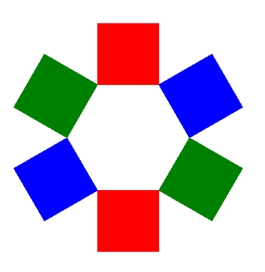
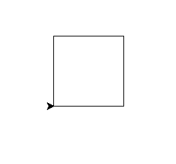
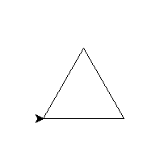
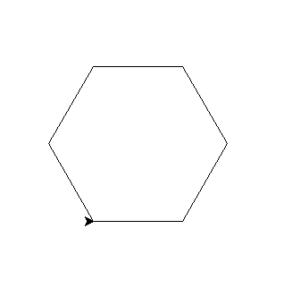
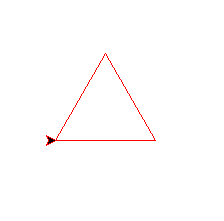
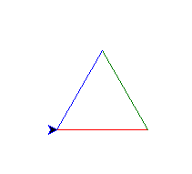
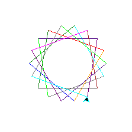

# Turtle, Python sheet 1

<style>
    body {
      counter-reset: page;
    }
    img {
    	width: 100%
	}
    table {
   		width: 100%
	}
   table.key_info {
    	width: 100%;
	}
    table.key_info, .key_info td {
    	background-color: blue;
    	color: white;
	}

	@media print {
	   pre, blockquote {page-break-inside: avoid;}
		h3, h2  { page-break-after: avoid; }
	
		.page::after {
			counter-increment: page;
		   content: "Page " counter(page);
		}
		.page {
			page-break-after: always;
			display: block;
			position: fixed;
			bottom: 0pt;
			right: 0pt;
	   }
	}
</style>

<table class="key_info">
<tr><td>Level: Beginner</td>
<td>Language: Python</td>
<td>Requires: Laptop with Python</td></tr>
</table>



We'll use python to make shapes with turtle graphics, starting from a simple square and then working up to more interesting shapes.

<div class="page"></div>

## Warm up - Squares in turtle

In the editor, type this code:

```python
    import turtle

    for n in range(4):
        turtle.forward(100)
        turtle.left(90)
```

When you save and run, you'll get something like this:



Or perhaps a triangle, in a new file try this:

```python
    import turtle

    for n in range(3):
        turtle.forward(100)
        turtle.left(120)
```



Now if I told you that a Hexagon has 6 sides, and it needs to turn left by 60, can you write code that does this?



Lets make this a bit more interesting though - these are all very nice, but not too colourful. In one of the examples before (I chose triangle), add pen colour before the loop:

```python
    turtle.pencolor("red")

    for n in range(3):
        turtle.forward(100)
        turtle.left(120)
```



## More colours 

There is a "gotcha" here - turtle spells colour without a "u"!

In your last example, change the loop to this:

```python
    trianglecolours = ["red", "green", "blue"]
    for colour in trianglecolours:
        turtle.pencolor(colour)
        turtle.forward(100)
        turtle.left(120)
```



## Using colours more than once

You can put colours into list, and then draw from the list:

```python
    import turtle

    myshape = ["red", "blue", "yellow"] * 2

    for colour in myshape:
        turtle.pencolor(colour)
        turtle.forward(100)
        turtle.left(60)
```

How many sides are there? Could you use the same to make an octagon? Hint: turn left by 45, it has 8 sides.

There's a reference with many colour names at the back of this sheet.

## More shapes

If you modify the number of times you multiply the colours, and the number by which the turtle turns, you can create many different colourful shapes.



```python
import turtle

myshape = ["green", "blue", "orange", "red", "forest green", "black",
           "brown", "magenta", "purple", "indigo", "lime", "gray", "cyan"] * 2

for colour in myshape:
    turtle.pencolor(colour)
    turtle.forward(100)
    turtle.left(100)
```

## Fancier shapes

So these shapes are all a bit, well flat and possibly boring. 
So how can we do more interesting stuff?

Python has functions, which give a name to a bit of code. Every time you use that name, with some brackets "()", you tell it to use that named code again.

```python
    def square():
        for n in range(4):
            turtle.forward(100)
            turtle.left(90)

    for n in range(6):
        square()
        turtle.forward(100)
        turtle.right(60)
```

And combine with the colour lists to make it colourful:

```python
    colours = ["red", "blue", "green"] * 2
    for colour in colours:
        turtle.pencolor(colour)
        square()
        turtle.forward(100)
        turtle.right(60)
```

If we change it so they are filled this gets even more fun:


```python
    def square():
        turtle.begin_fill()
        for n in range(4):
            turtle.forward(100)
            turtle.left(90)
        turtle.end_fill()

    colours = ["red", "blue", "green"] * 2
    for colour in colours:
        turtle.pencolor(colour)
        turtle.fillcolor(colour)
        square()
        turtle.forward(100)
        turtle.right(60)

    import turtle 

    star = turtle.Turtle()

    for i in range(50):
        star.forward(50)
        star.right(144)
        
    turtle.done()
```    
    
## Basic turtle commands

For quick reference - here are some of the commonly used turtle commands:

| Command          | Effect      |
|------------------|-------------|
| turtle.forward   | Go forward  |
| turtle.backward  | Go backward |
| turtle.right     | Turn right  |
| turtle.left      | Turn left   |
| 	                             |
| turtle.penup()   | Lifts the pen up so you can move the turtle without drawing |
| turtle.pendown() | Drops the pen back onto the screen so you  can draw |
| turtle.fillcolor(“Brown”) | Changes the fill colour to brown (or other colour) |
| turtle.pencolor(“Red”)    | Changes the pen colour to red (or other colour) |
| turtle.begin_fill()       | Begins to fill the shape |
| turtle.end_fill()         | End the filling sequence |

## Turtle Colours

<!-- -- id="colours" -->

This is a limited list. Look up "TK colours" for more names. You can also use three numbers for red, green and blue to mix your
own colours: `t.color((172, 38, 53))` <span style="background: rgb(172, 38, 53)">Sample</span>.

<table>
<thead><tr><th>Colour Name</th><th>Sample</th></tr></thead>
<tbody>
    <tr><td>red</td><td style="background: red">&nbsp;</td></tr>
    <tr><td>blue</td><td style="background: blue">&nbsp;</td></tr>
    <tr><td>green</td><td style="background: green">&nbsp;</td></tr>
    <tr><td>yellow</td><td style="background: yellow">&nbsp;</td></tr>
    <tr><td>salmon</td><td style="background: salmon">&nbsp;</td></tr>
    <tr><td>orange</td><td style="background: orange">&nbsp;</td></tr>
    <tr><td>black</td><td style="background: black">&nbsp;</td></tr>
    <tr><td>white</td><td style="background: white">&nbsp;</td></tr>
</tbody>
</table>

Its worth trying other colour names and seeing what works.
