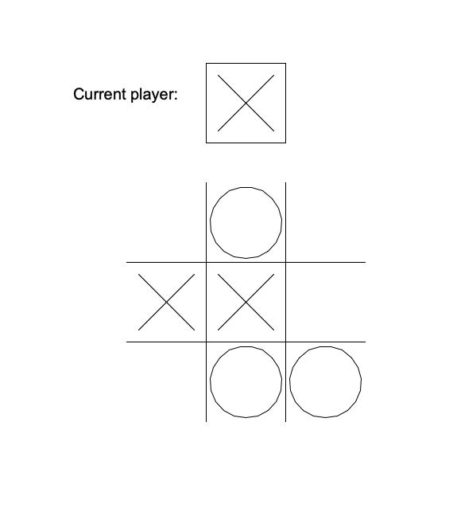
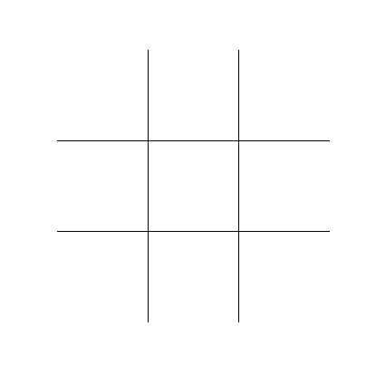

<link rel="stylesheet" href="../css/sheet.css">

<table class="key_info">
<tr><td>Level: Intermediate</td>
<td>Language: Python</td>
<td>Requires: Laptop with Python</td></tr>
</table>



Python turtle can be used to make interactive games. In this worksheet we'll use it to make a simple tictactoe game.
Players take turns to place an X or O on the board with mouse clicks. The first player to get three in a row wins.

We'll be using elements you've seen - variables, functions, lists and introducing a new element - classes.
This sheet builds on the techniques seen in the Make It Rain worksheet.

This sheet recmmends using Mu in Python 3 mode. You can download it from [here](https://codewith.mu/).

## The board

We'll start by setting up turtle (calling it `pen`):

```python
import turtle

pen = turtle.Turtle()
pen.speed(0)
pen.hideturtle()
pen.penup()
turtle.tracer(0, 0)
```

On this we can draw the game board:

```python
GRID_CELL_SIZE = 100
TOP_LEFT = (-(GRID_CELL_SIZE * 1.5), (GRID_CELL_SIZE * 1.5))
# horizontal
pen.goto(TOP_LEFT[0], GRID_CELL_SIZE/2)
pen.pendown()
pen.forward(GRID_CELL_SIZE * 3)
pen.penup()
pen.goto(TOP_LEFT[0],-GRID_CELL_SIZE/2)
pen.pendown()
pen.forward(GRID_CELL_SIZE * 3)
pen.penup()
# Vertical lines
pen.goto(-GRID_CELL_SIZE/2, TOP_LEFT[1])
pen.right(90)
pen.pendown()
pen.forward(GRID_CELL_SIZE * 3)
pen.penup()
pen.goto( GRID_CELL_SIZE/2, TOP_LEFT[1])
pen.pendown()
pen.forward(GRID_CELL_SIZE * 3)

turtle.update()
turtle.done()
```

We use CELL_GRID_SIZE to set the size of the grid. We use TOP_LEFT to set the top left corner of the grid.
We then draw the horizontal and vertical lines above and below the middle of the screen.

